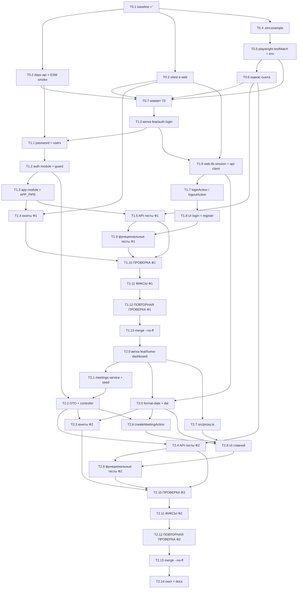

# План имплементации: логин `/auth/login` + главная `/`

Парный документ — [feature-plan-testing.md](feature-plan-testing.md) (организация тестов и тест-кейсы).
Разделение ответственности: **этот файл владеет архитектурой приложения и порядком задач**, тест-план
владеет структурой сьюта, именами файлов тестов и перечнем кейсов. При расхождении по тестам
приоритет у тест-плана, по коду приложения — у этого файла.

## 0. Проверенные факты об окружении

Проверено чтением исходников в `node_modules` и фактическими прогонами, а не по памяти:

| Факт                                                                                                                             | Источник                                                               | Следствие                                                                   |
| -------------------------------------------------------------------------------------------------------------------------------- | ---------------------------------------------------------------------- | --------------------------------------------------------------------------- |
| `middleware.ts` **deprecated** в Next 16, переименован в `proxy.ts`                                                              | `apps/web/node_modules/next/dist/docs/.../middleware.md`               | Файл называется `apps/web/src/proxy.ts`, экспорт — `proxy`                  |
| `proxy` по умолчанию на Node.js-runtime; `runtime` в config запрещён                                                             | `.../03-file-conventions/proxy.md`                                     | Проверка в proxy — только «оптимистичная», не гарантия безопасности         |
| Матчер, исключающий путь, **исключает и Server Actions на этом пути**                                                            | `.../proxy.md`                                                         | Проверка сессии обязана дублироваться внутри каждого Server Action          |
| `cookies()` — async; `.set`/`.delete` только в Server Function / Route Handler                                                   | `.../04-functions/cookies.md`                                          | Cookie ставится только в Server Action, не при рендере страницы             |
| `fetch` в Next 16 **не кэшируется по умолчанию**; `cacheComponents` выключен                                                     | `.../06-fetching-data.md`; в `next.config.ts` флага нет                | Серверный fetch к Nest дефолтом динамический                                |
| `import 'server-only'` алиасится Next на `next/dist/compiled/server-only`; пакета в `node_modules` нет; тип есть в `global.d.ts` | `next/dist/build/create-compiler-aliases.js`, `next/types/global.d.ts` | `tsc` и `next build` — ок, **Vitest такой импорт не резолвит**              |
| `HttpException.createBody`: без аргумента → `{message, statusCode}`; со строкой → `{message, error, statusCode}`                 | `@nestjs/common/exceptions/http.exception.js`                          | Формы ошибок в §2.1 — точные, не угаданные                                  |
| Nest 12 — чистый ESM; `@nestjs/core/index.js` сам делает `import 'reflect-metadata'`                                             | `@nestjs/core/index.js`                                                | В `main.ts` отдельный импорт `reflect-metadata` не нужен                    |
| `@nestjs/jwt@12.0.1` — ESM, зависит от `jsonwebtoken@9` (CJS)                                                                    | `npm view`                                                             | Совместим с ESM-Nest                                                        |
| `class-validator@0.15` / `class-transformer@0.5` — **CJS без `exports`**                                                         | `npm view`                                                             | Named-импорты из ESM идут через cjs-module-lexer → нужен smoke-check (T0.2) |
| `pnpm test` в `apps/api` **проходит**, причём `AppController` получает внедрённый `AppService`                                   | фактический прогон                                                     | `emitDecoratorMetadata` под Vitest 4 работает, Nest-DI в юнитах жив         |
| `webServer.env` в Playwright мержится поверх `process.env`                                                                       | `playwright/types/test.d.ts`                                           | Можно добавлять только новые переменные                                     |
| В `master` не было ни одного коммита, remote отсутствует                                                                         | `git log`                                                              | Baseline-коммит обязателен до создания веток (**уже сделан**, `fe07cfe`)    |

---

## 1. Итоговая архитектура

### 1.1 Дерево файлов

Пути к тестам приведены к конвенции регрессионного сьюта из тест-плана (§1.1–1.3 там).

```
docs/plans/feature-plan-implementation.md   [нов] этот план
docs/plans/feature-plan-testing.md          [есть] тест-план
docs/plans/README.md                        [нов] индекс планов и правило приоритета

playwright.config.ts                        [изм] testMatch по суффиксам + env для webServer
package.json                                [изм] скрипты e2e:*, test:auth-login, test:home-dashboard
eslint.config.mjs                           [изм] T0.6: три playwright-правила warn → error
CLAUDE.md                                    [изм] T0.6: разделы «Тесты: что где» и «Проверка изменений»
.claude/skills/playwright-verify/SKILL.md    [изм] T0.6: пути e2e/web|api → e2e/regression/<feature>
.claude/skills/regression-verify/SKILL.md    [нов] T0.6 черновик, T2.14 финал (спецификация — тест-план §6)

e2e/README.md                               [нов] индекс сьюта
e2e/suite-integrity.api.spec.ts             [нов] мета-тест конвенции сьюта
e2e/fixtures/seed.ts                        [нов] зеркало сида: SEED_USERS, ожидаемые встречи
e2e/fixtures/auth.api.ts                    [нов] loginApi(request, user) → token; authHeaders(token)
e2e/fixtures/api.ts                         [нов] API_BASE_URL + фикстура apiRequest (тест-план §5.5)
e2e/fixtures/auth.fixture.ts                [нов] опция authUser (тест) + кэш authStateFor (воркер) + authedPage (тест)
e2e/fixtures/console.ts                     [нов] DEV_SERVER_NOISE + collectConsoleProblems(page)
e2e/smoke/health.api.{cases.md,spec.ts}     [нов/переезд] из e2e/api/health.spec.ts
e2e/smoke/seed.api.{cases.md,spec.ts}       [нов] сид на месте: SM-API-02 в T1.5, SM-API-03 в T2.4
e2e/regression/auth-login/                  [нов] 5 файлов (api/functional/unit — см. тест-план)
e2e/regression/home-dashboard/              [нов] 5 файлов
e2e/api/health.spec.ts                      [удл] T0.6: переезжает в e2e/smoke/
e2e/web/home.spec.ts                        [удл] T0.6: не запускается при testMatch по суффиксам (риск 22)

apps/api/.env.example                       [изм] + JWT_SECRET, JWT_EXPIRES_IN
apps/api/package.json                       [изм] + @nestjs/jwt, class-validator, class-transformer
apps/api/src/main.ts                        [изм] комментарий про осознанное отсутствие CORS/префикса
apps/api/src/app.module.ts                  [изм] imports: AuthModule, MeetingsModule; провайдер APP_PIPE
apps/api/src/config/auth.config.ts          [нов] JWT_SECRET/JWT_EXPIRES_IN с дефолтами для dev/e2e
apps/api/src/common/crypto/password.ts      [нов] hashPassword / verifyPassword (scrypt + timingSafeEqual)
apps/api/src/common/crypto/password.spec.ts [нов] AL-UT-09…11: юниты хеширования
apps/api/src/users/user.types.ts            [нов] User, PublicUser
apps/api/src/users/users.seed.ts            [нов] SEED_USERS (плейнтекст-пароли только здесь)
apps/api/src/users/users.mapper.ts          [нов] toPublicUser (срезает passwordHash)
apps/api/src/users/users.service.ts         [нов] in-memory Map, хеширование сида при инициализации
apps/api/src/users/users.service.spec.ts    [нов]
apps/api/src/users/users.module.ts          [нов] экспортирует UsersService
apps/api/src/auth/auth.types.ts             [нов] JwtPayload, AuthenticatedUser, AuthenticatedRequest
apps/api/src/auth/dto/login.dto.ts          [нов] LoginDto
apps/api/src/auth/password.service.ts       [нов] тонкая обёртка над common/crypto для DI (без своего спека)
apps/api/src/auth/token.service.ts          [нов] обёртка над JwtService: sign/verify + типизация payload
apps/api/src/auth/token.service.spec.ts     [нов]
apps/api/src/auth/auth.service.ts           [нов] login(): проверка пароля + подпись токена
apps/api/src/auth/auth.service.spec.ts      [нов]
apps/api/src/auth/jwt-auth.guard.ts         [нов] Bearer → verifyAsync → request.user
apps/api/src/auth/jwt-auth.guard.spec.ts    [нов] AL-UT-27, AL-UT-28
apps/api/src/auth/current-user.decorator.ts [нов] @CurrentUser()
apps/api/src/auth/auth.controller.ts        [нов] POST /auth/login (@HttpCode 200), GET /auth/me
apps/api/src/auth/auth.module.ts            [нов] JwtModule.register + экспорт JwtAuthGuard
apps/api/src/meetings/meeting.types.ts      [нов] Meeting, MeetingDto
apps/api/src/meetings/meetings.seed.ts      [нов] SEED_MEETINGS
apps/api/src/meetings/meetings.mapper.ts    [нов] toMeetingDto (срезает ownerId)
apps/api/src/meetings/meetings.service.ts   [нов] дефолт limit=3, сортировка DESC, изоляция по владельцу
apps/api/src/meetings/meetings.service.spec.ts  [нов]
apps/api/src/meetings/dto/create-meeting.dto.ts [нов]
apps/api/src/meetings/dto/list-meetings-query.dto.ts [нов]
apps/api/src/meetings/meetings.controller.ts [нов] GET /meetings, POST /meetings
apps/api/src/meetings/meetings.module.ts    [нов]

apps/web/package.json                       [изм] + devDep vitest, скрипт "test"
apps/web/vitest.config.ts                   [нов] environment: node, include src/**/*.spec.ts
apps/web/.env.example                       [нов] API_URL
apps/web/src/lib/types.ts                   [нов] PublicUser, Meeting, MeetingsPage, *FormState
apps/web/src/lib/api-client.ts              [нов] resolveApiUrl, apiFetch, ApiError
apps/web/src/lib/api-client.spec.ts         [нов] AL-UT-23…26: resolveApiUrl + ApiError.message (без сети)
apps/web/src/lib/session-cookie.ts          [нов] SESSION_COOKIE_NAME + buildSessionCookieOptions (чистый)
apps/web/src/lib/session.spec.ts            [нов] AL-UT-20…22: опции cookie (имя файла — по тест-плану)
apps/web/src/lib/session.ts                 [нов] 'server-only' + cookies(): create/read/destroy
apps/web/src/lib/format-date.ts             [нов] formatMeetingDateTime, toIsoStartsAt (чистые)
apps/web/src/lib/format-date.spec.ts        [нов] HD-UT-10, HD-UT-11, HD-UT-15, HD-UT-16
apps/web/src/lib/dal.ts                     [нов] 'server-only': getCurrentUser (cache), getMeetings
apps/web/src/lib/actions/auth.ts            [нов] 'use server': loginAction, logoutAction
apps/web/src/lib/actions/meetings.ts        [нов] 'use server': createMeetingAction
apps/web/src/proxy.ts                       [нов] Ф2: гейт '/' и обратный редирект с /auth/login
apps/web/src/app/layout.tsx                 [изм] lang="ru", metadata title/description
apps/web/src/app/auth/layout.tsx            [нов] общая рамка для /auth/*
apps/web/src/app/auth/auth.module.css       [нов]
apps/web/src/app/auth/login/page.tsx        [нов] серверный компонент, рендерит LoginForm
apps/web/src/app/auth/login/login-form.tsx  [нов] 'use client', useActionState
apps/web/src/app/auth/login/login-form.module.css [нов]
apps/web/src/app/auth/register/page.tsx     [нов] заглушка (осознанное допущение, §8)
apps/web/src/app/page.tsx                   [изм] Ф2: полностью переписать
apps/web/src/app/page.module.css            [изм] Ф2: полностью переписать
apps/web/src/components/meeting-list.tsx    [нов] серверный компонент, ul aria-label="Последние встречи"
apps/web/src/components/meeting-list.module.css [нов]
apps/web/src/components/create-meeting-form.tsx [нов] 'use client', useActionState
apps/web/src/components/create-meeting-form.module.css [нов]
apps/web/src/components/logout-button.tsx   [нов] серверный компонент: form action={logoutAction}
apps/web/src/components/logout-button.module.css [нов]
```

### 1.2 Новые зависимости

| Пакет               | Версия    | Куда                         | Команда                                                                                |
| ------------------- | --------- | ---------------------------- | -------------------------------------------------------------------------------------- |
| `@nestjs/jwt`       | `^12.0.1` | `apps/api` → dependencies    | `pnpm --filter @purpleschool/api add @nestjs/jwt@^12.0.1`                              |
| `class-validator`   | `^0.15.1` | `apps/api` → dependencies    | `pnpm --filter @purpleschool/api add class-validator@^0.15.1 class-transformer@^0.5.1` |
| `class-transformer` | `^0.5.1`  | `apps/api` → dependencies    | (та же команда)                                                                        |
| `vitest`            | `^4.1.2`  | `apps/web` → devDependencies | `pnpm --filter @purpleschool/web add -D vitest@^4.1.2`                                 |

Больше ничего не ставим, и это осознанно:

- `bcrypt` не нужен — `node:crypto.scrypt` без нативной сборки;
- `jose`/`iron-session` не нужны — в cookie кладём уже подписанный Nest-ом JWT;
- `@nestjs/passport`/`passport-jwt` не нужны — свой `JwtAuthGuard` на ~25 строк;
- `@nestjs/config` не нужен — секреты читаются из `process.env` с дефолтами (§3.6);
- `server-only` не нужен — Next алиасит его сам (§0);
- `@testing-library/*`/`jsdom` не нужны — React-компоненты покрыты Playwright, Vitest — только чистые хелперы.

### 1.3 Схема потоков

```
Браузер ──GET /auth/login──────────────► Next   page.tsx → LoginForm ('use client')
Браузер ──Server Action loginAction────► Next  ──fetch POST /auth/login──► Nest
                                          Next ◄──200 {accessToken,user}──
                                          Next  cookies().set('ps_session', token, httpOnly)
Браузер ◄──redirect '/'─────────────────  Next
Браузер ──GET /────────────────────────► Next   proxy.ts: cookie есть? нет → 307 /auth/login
                                          Next   page.tsx → dal.getCurrentUser()
                                                 ──GET /auth/me       (Bearer из cookie)──► Nest
                                                 ──GET /meetings?limit=3 (Bearer)────────► Nest
Браузер ──Server Action createMeeting──► Next  ──POST /meetings (Bearer)──► Nest → revalidatePath('/')
Браузер ──Server Action logoutAction───► Next   cookies().delete('ps_session') → redirect '/auth/login'
```

Браузер **никогда** не обращается к Nest напрямую; JWT никогда не попадает в JS браузера. Это проверяется кейсами `AL-FN-13` (cookie `httpOnly`, JWT не виден из JS) и `HD-FN-11` (в трафике браузера нет ни одного запроса на `:3101` — ни на логине, ни на дашборде).

### 1.4 Решение по CORS и глобальному префиксу

**CORS не включаем, глобальный префикс не добавляем.**

- CORS-заголовки нужны только для запросов из браузерного origin. Единственные клиенты Nest — серверный `fetch` из Next и фикстура `request` Playwright; ни там, ни там preflight не проверяется. `app.enableCors()` без аргументов ставит `Access-Control-Allow-Origin: *`, то есть открывает API любому сайту — расширение поверхности атаки за ноль пользы.
- Глобальный префикс сломал бы `SM-API-01` (`GET /` → `Hello World!`) и потребовал бы дублировать префикс во всех путях. Пути и так неконфликтны: `/`, `/auth/*`, `/meetings`.
- В `main.ts` добавляем комментарий с этим обоснованием, чтобы следующий агент не «дорисовал» CORS на автомате.

---

## 2. API-контракт

`Content-Type: application/json` для всех, кроме `GET /`.

| #   | Метод  | Путь               | Авториз. | Тело запроса                                                        | Успех                                                              | Ошибки      |
| --- | ------ | ------------------ | -------- | ------------------------------------------------------------------- | ------------------------------------------------------------------ | ----------- |
| 1   | `GET`  | `/`                | нет      | —                                                                   | `200` `text/plain`: `Hello World!`                                 | —           |
| 2   | `POST` | `/auth/login`      | нет      | `{"email": string, "password": string}`                             | **`200`** `{"accessToken": string, "user": {"id","email","name"}}` | `400`,`401` |
| 3   | `GET`  | `/auth/me`         | `Bearer` | —                                                                   | `200` `{"id","email","name"}`                                      | `401`       |
| 4   | `GET`  | `/meetings?limit=` | `Bearer` | —                                                                   | `200` `{"items": MeetingDto[], "total": number}`                   | `400`,`401` |
| 5   | `POST` | `/meetings`        | `Bearer` | `{"title": string, "startsAt": string, "durationMinutes"?: number}` | `201` `MeetingDto`                                                 | `400`,`401` |

`MeetingDto` = `{"id": string, "title": string, "startsAt": string /* ISO 8601 UTC */, "durationMinutes": number}`. **`ownerId` в ответе отсутствует** — срезается `toMeetingDto` (проверяет `HD-API-01`, который сверяет набор ключей элемента).

### 2.1 Точные тела ошибок

Формы выведены из `HttpException.createBody` (§0), а не угаданы.

| Ситуация                               | Код   | Тело                                                                                                                                                                                                                                                                                                                    |
| -------------------------------------- | ----- | ----------------------------------------------------------------------------------------------------------------------------------------------------------------------------------------------------------------------------------------------------------------------------------------------------------------------- |
| `ValidationPipe` отверг payload        | `400` | `{"message": ["email must be an email", "password should not be empty"], "error": "Bad Request", "statusCode": 400}`                                                                                                                                                                                                    |
| Лишнее поле при `forbidNonWhitelisted` | `400` | `{"message": ["property role should not exist"], "error": "Bad Request", "statusCode": 400}`                                                                                                                                                                                                                            |
| Неверный email/пароль                  | `401` | `{"message": "Неверный email или пароль", "error": "Unauthorized", "statusCode": 401}`                                                                                                                                                                                                                                  |
| Нет/битый/просроченный Bearer          | `401` | `{"message": "Требуется авторизация", "error": "Unauthorized", "statusCode": 401}`                                                                                                                                                                                                                                      |
| `limit` вне `1..100` или не число      | `400` | `{"message": ["limit must not be less than 1"], "error": "Bad Request", "statusCode": 400}` — при **нечисловом** значении в массиве приходят три сообщения (`must not be greater than 100`, `must not be less than 1`, `must be an integer number`), поэтому сверять по вхождению, а не по равенству (проверено пробой) |
| `durationMinutes` вне `15..480`        | `400` | `{"message": ["durationMinutes must not be less than 15"], "error": "Bad Request", "statusCode": 400}`                                                                                                                                                                                                                  |
| `limit > 100`                          | `400` | `{"message": ["limit must not be greater than 100"], "error": "Bad Request", "statusCode": 400}`                                                                                                                                                                                                                        |
| Битый JSON в теле                      | `400` | `{"message": "Unexpected end of JSON input", "error": "Bad Request", "statusCode": 400}` — здесь `message` **строка**: тело формирует `body-parser` **до** `ValidationPipe`, наш код не участвует                                                                                                                       |
| Метод/путь не найден                   | `404` | `{"message": "Cannot GET /auth/login", "error": "Not Found", "statusCode": 404}` — детерминированно `404`, не `405` (проверено пробой)                                                                                                                                                                                  |

`message` — **массив строк только у ошибок `ValidationPipe`**; у `HttpException`, брошенного нами
(`401`), и у ошибок `body-parser` (`400` на битом JSON) это **строка**. Кейсы `AL-API-02`,
`AL-API-04`, `AL-API-14` должны учитывать разницу: ассерт «`message` — всегда массив» покраснеет на
корректном коде.

Две последние строки таблицы кейсами не покрыты осознанно: соответствующие проверки (`AL-API-18`,
`AL-API-19`) удалены по §5.1 ревью 1 как тестирующие `body-parser` и роутер Express. Формы оставлены
в контракте, чтобы следующий агент, увидев такой ответ, не «починил» его наугад.

### 2.2 Обязательные детали реализации контракта

1. **`POST /auth/login` обязан иметь `@HttpCode(HttpStatus.OK)`.** Nest по умолчанию отвечает на POST кодом `201`; без декоратора `AL-API-01` покраснеет.
2. `POST /meetings` декоратора кода не требует — `201` здесь и есть правильный ответ (`HD-API-13`).
3. `LoginDto`: `@IsEmail()` + `@IsString() @IsNotEmpty()`. **Никаких требований к сложности пароля на логине** — иначе неверный пароль даст `400` вместо `401`, и пункт спецификации «показывает ошибку при неверных данных» станет непроверяемым (`AL-API-02`).
4. **`ListMeetingsQueryDto`: `limit?: number` с `@IsOptional() @Type(() => Number) @IsInt() @Min(1) @Max(100)`**; при отсутствии параметра сервис подставляет `3`. Фиксируют `HD-API-08`, `HD-API-09`, `HD-API-10`.
   - `@IsOptional()` **обязателен**. Без него при `whitelist: true, transform: true` отсутствующее поле проходит через `@IsInt/@Min/@Max` и `GET /meetings` **без параметра** отдаёт `400` (проверено пробой на `@nestjs/common@12.0.1` + `class-validator@0.15.1`: `/meetings → 400 {"message":["limit must not be greater than 50","limit must not be less than 1","limit must be an integer number"]}`). Это уронило бы всю страницу дашборда — `dal.getMeetings()` ходит без параметра только в тестах контракта, но `HD-API-10` шаг 2 и `SM-API-03` без `@IsOptional()` красные на корректном по остальным пунктам коде.
   - Верхняя граница — `@Max(100)`, а не `50`: `limit=100` используется как «отдай всё» в `HD-API-17` и `SM-API-03`. Вариант «переписать кейсы на `limit=50`» отвергнут — он завязывает смоук сида на магическое число, которое придётся менять при росте сида. Значение `> 100` даёт `400` (строка в §2.1).
5. `CreateMeetingDto`: `title` `@IsString() @Length(3, 100)`; `startsAt` `@IsISO8601()`; `durationMinutes?` `@IsOptional() @Type(() => Number) @IsInt() @Min(15) @Max(480)`; при отсутствии поля сервис подставляет `60`. **`@IsOptional()` обязателен** — без него `POST /meetings` без `durationMinutes` даёт 400 (проверено пробой на `@nestjs/common@12.0.1` + `class-validator@0.15.1`), а именно так его отправляют и `createMeetingAction` (`T2.6`), и форма из `T2.8`: кнопка «Создать встречу» не работала бы вовсе. Ловится кейсом `HD-API-20` на контрактном уровне.
6. `ValidationPipe` регистрируется **провайдером `APP_PIPE` в `AppModule`**, а не только `app.useGlobalPipes` в `main.ts`. Иначе `apps/api/test/app.e2e-spec.ts` и любые `Test.createTestingModule({imports:[AppModule]})` поднимут приложение без валидации, и проверки `400` разойдутся с реальным сервером:
   ```ts
   { provide: APP_PIPE, useValue: new ValidationPipe({ whitelist: true, forbidNonWhitelisted: true, transform: true }) }
   ```
7. `JwtAuthGuard` навешивается `@UseGuards(JwtAuthGuard)` на `GET /auth/me` и на `MeetingsController` целиком. Глобальный guard не ставим — он сломал бы `GET /` и `POST /auth/login`.

---

## 3. Модель данных и состав сида

### 3.1 Типы (`apps/api`)

```ts
// users/user.types.ts
export interface User {
  id: string;
  email: string;
  name: string;
  passwordHash: string;
}
export type PublicUser = Omit<User, 'passwordHash'>;

// meetings/meeting.types.ts
export interface Meeting {
  id: string;
  ownerId: string;
  title: string;
  startsAt: string;
  durationMinutes: number;
}
export type MeetingDto = Omit<Meeting, 'ownerId'>;

// auth/auth.types.ts
export interface JwtPayload {
  sub: string;
  email: string;
}
export interface AuthenticatedUser {
  id: string;
  email: string;
}
export interface AuthenticatedRequest extends Request {
  user: AuthenticatedUser;
}
```

`startsAt` — строка ISO 8601 в UTC (`…Z`), не `Date`: значение переживает JSON-сериализацию без сюрпризов и стабильно сравнивается в тестах.

### 3.2 Формат `passwordHash`

`scrypt$<saltHex>$<keyHex>`, где `salt = randomBytes(16)`, `key = scryptSync(password, salt, 64)`. Проверка: разобрать строку, посчитать `scryptSync` с тем же salt, сравнить `timingSafeEqual`. Битый или чужого формата хеш → `false`, не исключение. Покрыто `AL-UT-09…11` (спек лежит у реализации — `common/crypto/password.spec.ts`; у `PasswordService` своего спека нет, он DI-обёртка, его делегация проверяется моком в `AL-UT-06`).

Хеши сида **вычисляются при инициализации `UsersService`** из плейнтекст-констант в `users.seed.ts`, а не хардкодятся хекс-литералами: литералы нельзя воспроизвести и нельзя поменять пароль, не переписав их вручную, а изменение параметров scrypt молча ломает вход. Плейнтексты живут ровно в одном файле — осознанный компромисс демо без БД, зафиксирован в §8.

### 3.3 Сид пользователей (`users.seed.ts`)

Один общий пароль для всех сид-пользователей — `Passw0rd!`. Разные пароли не добавляют ничего проверяемого, а в тест-кейсах создают шум.

| id              | email                         | пароль      | name                 | встреч | роль в сьюте                                                   |
| --------------- | ----------------------------- | ----------- | -------------------- | ------ | -------------------------------------------------------------- |
| `usr-teacher`   | `teacher@purpleschool.test`   | `Passw0rd!` | `Анна Преподаватель` | **5**  | read-only: `total = 5`, «последние 3», порядок. Не мутировать. |
| `usr-student`   | `student@purpleschool.test`   | `Passw0rd!` | `Иван Студент`       | **0**  | read-only: граничный кейс «нет встреч». Не мутировать.         |
| `usr-planner`   | `planner@purpleschool.test`   | `Passw0rd!` | `Мария Планировщик`  | **1**  | песочница мутаций **только** для `*.api.spec.ts`               |
| `usr-organizer` | `organizer@purpleschool.test` | `Passw0rd!` | `Пётр Организатор`   | **1**  | песочница мутаций **только** для `*.functional.spec.ts`        |

Четыре, а не два пользователя — сознательно: `POST /meetings` мутирует общий in-memory store, а Playwright гоняет `fullyParallel: true`, поэтому у каждого мутирующего spec-файла должен быть свой владелец, иначе счётчики двух проектов будут гонять друг друга (§7, риск 9; тест-план §5.4).

Поиск по email — регистронезависимый (`email.trim().toLowerCase()`), это `AL-API-10` (логин под `TEACHER@Purpleschool.TEST`, а `GET /auth/me` отдаёт строго `teacher@purpleschool.test`) и `AL-UT-17`.

### 3.4 Сид встреч (`meetings.seed.ts`)

Даты фиксированные и абсолютные — никаких `Date.now()`, иначе ассерты поплывут.

| id                | ownerId         | title                            | startsAt                   | durationMinutes |
| ----------------- | --------------- | -------------------------------- | -------------------------- | --------------- |
| `mtg-teacher-1`   | `usr-teacher`   | `Вводный урок по алгебре`        | `2026-01-12T09:00:00.000Z` | 60              |
| `mtg-teacher-2`   | `usr-teacher`   | `Разбор домашнего задания`       | `2026-01-13T11:30:00.000Z` | 45              |
| `mtg-teacher-3`   | `usr-teacher`   | `Практикум по геометрии`         | `2026-01-15T14:00:00.000Z` | 90              |
| `mtg-teacher-4`   | `usr-teacher`   | `Консультация перед контрольной` | `2026-01-19T08:00:00.000Z` | 30              |
| `mtg-teacher-5`   | `usr-teacher`   | `Итоговое занятие модуля`        | `2026-01-22T16:15:00.000Z` | 60              |
| `mtg-planner-1`   | `usr-planner`   | `Ретро спринта`                  | `2026-01-16T13:00:00.000Z` | 45              |
| `mtg-organizer-1` | `usr-organizer` | `Планёрка команды`               | `2026-01-14T10:00:00.000Z` | 30              |

Сортировка по `startsAt` DESC ⇒ «последние 3» для `teacher` — ровно:

1. `Итоговое занятие модуля` (`2026-01-22`)
2. `Консультация перед контрольной` (`2026-01-19`)
3. `Практикум по геометрии` (`2026-01-15`)

Отсекаются `Разбор домашнего задания` и `Вводный урок по алгебре` — это эталон для `HD-API-04` и `HD-FN-05`.

`total` для `teacher` = `5` — **полное число встреч владельца, а не длина срезанного `items`**. Типовая ошибка, вынесена в DoD и в контрольный опыт T2.10.

Новые встречи получают `id` из `randomUUID()` и `ownerId` из токена. Клиент `ownerId` передать не может: поле не описано в DTO, а `forbidNonWhitelisted` даст `400` (`HD-API-16`, `HD-API-17`).

**Все встречи, создаваемые тестами, датируются 2030 годом** (`2030-01-01T10:00:00.000Z` в API,
`2030-01-01T10:00` в поле `datetime-local`). Сортировка DESC + срез топ-3 означают, что ассерт «новая
встреча первая в списке» верен только при дате позже любой сид-встречи владельца: у `organizer` это
`2026-01-14T10:00:00.000Z`, у `planner` — `2026-01-16T13:00:00.000Z`. Правило зафиксировано в
тест-плане §5.4 (правило 5) и в шагах `HD-API-13`, `HD-API-17`, `HD-FN-07`.

### 3.5 Типы и cookie на стороне `apps/web`

```ts
// lib/types.ts — типы держим тут, а не в 'use server'-файлах
export interface PublicUser {
  id: string;
  email: string;
  name: string;
}
export interface Meeting {
  id: string;
  title: string;
  startsAt: string;
  durationMinutes: number;
}
export interface MeetingsPage {
  items: Meeting[];
  total: number;
}
export interface LoginFormState {
  error?: string;
  email?: string;
}
export interface CreateMeetingFormState {
  error?: string;
}
```

Cookie: имя **`ps_session`**, значение — `accessToken` из Nest без дополнительной обёртки.

```ts
// lib/session-cookie.ts — чистый модуль, БЕЗ 'server-only' и БЕЗ next/headers
export const SESSION_COOKIE_NAME = 'ps_session';
export const SESSION_MAX_AGE_SECONDS = 60 * 60; // совпадает с JWT_EXPIRES_IN='1h'
export function buildSessionCookieOptions(nodeEnv: string | undefined) {
  return {
    httpOnly: true,
    sameSite: 'lax' as const,
    path: '/',
    maxAge: SESSION_MAX_AGE_SECONDS,
    secure: nodeEnv === 'production', // ← НЕ true безусловно, см. §7 риск 1
  };
}
```

Разделение `session-cookie.ts` (чистый) / `session.ts` (`'server-only'` + `cookies()`) — не косметика: Vitest не резолвит `server-only` (§0), поэтому всё тестируемое обязано лежать в файле без этого импорта. Юниты — `AL-UT-20…22` (опции cookie и совпадение `SESSION_MAX_AGE_SECONDS` с `JWT_EXPIRES_IN`); юниты `api-client.ts` — `AL-UT-23…26`.

Функций `parseSession`/`serializeSession` в архитектуре **нет** и не появится: в cookie лежит сырой
JWT, разбирать его на стороне web незачем — валидность подтверждает Nest на `GET /auth/me`. Кейсы
тест-плана, описывавшие такой парсинг, удалены (B7 ревью 1).

### 3.6 Переменные окружения

| Переменная       | Приложение | Дефолт в коде                               | Где переопределяется                                                                                                                         |
| ---------------- | ---------- | ------------------------------------------- | -------------------------------------------------------------------------------------------------------------------------------------------- |
| `PORT`           | api        | `3001`                                      | `playwright.config.ts` → `3101`                                                                                                              |
| `JWT_SECRET`     | api        | `'purpleschool-dev-secret'` + `Logger.warn` | переменная окружения процесса (оболочка, `webServer.env` Playwright → `'e2e-secret'`); `.env` **не** читается — dotenv не подключён (§8 п.4) |
| `JWT_EXPIRES_IN` | api        | `'1h'`                                      | переменная окружения процесса; `.env` **не** читается                                                                                        |
| `API_URL`        | web        | `'http://127.0.0.1:3001'`                   | `playwright.config.ts` → `'http://127.0.0.1:3101'` (Next читает `.env` сам, но в плане это не используется)                                  |

Секрет — стабильная константа, а не `randomBytes` при старте: `nest start --watch` перезапускается на каждой правке, и случайный секрет обнулял бы все выданные токены посреди прогона.

`apps/api` **не читает `.env`**: ни `dotenv`, ни `@nestjs/config` в зависимостях нет (осознанно, §8
п.4), `nest start` `.env` не загружает, `main.ts` берёт `process.env` напрямую. Поэтому
`apps/api/.env.example` документирует **контракт** переменных, а не работающий способ их задать:
задавать их нужно окружением процесса —

```powershell
$env:JWT_SECRET='my-secret'; pnpm dev:api
```

Если понадобится именно файл, это отдельная задача: `pnpm --filter @purpleschool/api add @nestjs/config`
плюс `ConfigModule.forRoot()`. В текущем плане такой задачи нет.

---

## 4. Задачи и подзадачи

DoD у каждой задачи — проверяемое условие, а не «сделано».

### T0 — Фундамент (ветка `master`, прямыми коммитами)

T0 держим тонким: только инфраструктура, ничего доменного. Nest-модуль `auth` — это и есть бэкенд фичи 1, `meetings` — фичи 2; выносить их в общий T0 значило бы сделать половину фичи 2 до фичи 1 и сломать требование строгой последовательности. Общего между фичами ровно пять вещей: зависимости, env-контракт, env-проводка Playwright, наличие vitest в web и каркас сьюта — они и составляют T0.

**T0.1 — Baseline-коммит скаффолда. ✅ ВЫПОЛНЕНО (`fe07cfe`).** Зависит от: —
DoD: `git log --oneline` показывает baseline-коммит; дерево до фич зафиксировано.

**T0.2 — Зависимости `apps/api` + smoke-check ESM-интеропа.** Зависит от: T0.1

- Файлы: `apps/api/package.json`, `pnpm-lock.yaml`.
- `pnpm --filter @purpleschool/api add @nestjs/jwt@^12.0.1 class-validator@^0.15.1 class-transformer@^0.5.1`.
- Затем **обязательная** проверка named-импортов из CJS в ESM, из каталога `apps/api`:
  ```bash
  node --input-type=module -e "import { IsEmail } from 'class-validator'; import { Type } from 'class-transformer'; import { JwtService } from '@nestjs/jwt'; console.log(typeof IsEmail, typeof Type, typeof JwtService);"
  ```
- DoD: вывод `function function function` без `SyntaxError: does not provide an export named …`.
- Если упало — не чинить хаками в бизнес-коде. Фолбэк по возрастанию цены: (а) `import * as cv from 'class-validator'`; (б) заменить пару на `zod@^4` (ESM-нативный) и собственный `ZodValidationPipe`, реализующий тот же контракт `400 {message: string[], error: 'Bad Request', statusCode: 400}`. Выбор зафиксировать в отчёте.

**T0.3 — Vitest в `apps/web`.** Зависит от: T0.1

- Файлы: `apps/web/package.json`, `apps/web/vitest.config.ts`.
- Файлы (дополнение): корневой `package.json` — скрипты `test:auth-login` и `test:home-dashboard`.
- `pnpm --filter @purpleschool/web add -D vitest@^4.1.2`; скрипт `"test": "vitest run --passWithNoTests"`; конфиг:
  ```ts
  import { defineConfig } from 'vitest/config';
  export default defineConfig({
    resolve: { tsconfigPaths: true }, // как в apps/api — даёт алиас @/*
    test: { environment: 'node', include: ['src/**/*.spec.ts'] },
  });
  ```
- `--passWithNoTests` обязателен: на момент T0.3 spec-файлов в `apps/web` **нет вообще**, а `vitest run` в таком пакете пишет `No test files found, exiting with code 1` и уронит корневой `pnpm test`. Флаг проверен (`vitest run --help`). Важно не спутать это с фильтром: `-t` без совпадений при наличии spec-файлов даёт `1 skipped` и код 0 — то есть флаг нужен именно из-за пустого пакета, а не из-за фильтрации. Снять его после появления спеков в web можно, но не нужно.
- Глобалы (`describe`/`it`) в web **не** включаем — в спеках `import { describe, expect, it } from 'vitest'`. Так не нужно трогать `types` в `apps/web/tsconfig.json` и спорить с `eslint-config-next`.
- **Запуск юнитов по одной фиче** (требование пользователя «проверки запускаются по каждой фиче в изоляции»; для e2e это `--grep @<feature>`, для юнитов до ревью 1 механизма не было вовсе). В корневой `package.json`:
  ```json
  "test:auth-login": "pnpm -r test -t \"AL-UT-\"",
  "test:home-dashboard": "pnpm -r test -t \"HD-UT-\""
  ```
  `-t` у `vitest run` фильтрует по имени теста, поэтому работает только вместе с правилом «заголовок юнит-теста начинается с ID кейса» (тест-план §2).
- **`--` между `pnpm -r test` и `-t` писать нельзя.** `pnpm -r test -- -t "AL-UT-"` прокидывает в скрипт пакета литеральный `--`, после которого `vitest` перестаёт считать `-t` опцией и гоняет **все** тесты пакета; заодно охват меняется на `all 5 workspace projects`, и корневой пакет рекурсивно вызывает сам себя. Проверено пробой (ревью 2, NB1): без `--` фильтр применяется, охват `4 of 5`, код выхода 0.
- **`--passWithNoTests` в корневых `test:<feature>` ставить нельзя** (поправка по факту реализации T0.3). Флаг уже несёт `test` в `apps/web`; корневой скрипт дописывает второй, и `vitest@4.1.11` падает: `Expected a single value for option "--passWithNoTests", received [true, true]` → `ERR_PNPM_RECURSIVE_RUN_FIRST_FAIL`. Флаг живёт ровно в одном месте — в `apps/web/package.json`, где он обязателен, пока в web нет спеков. Корневые скрипты — без него.
- DoD: `pnpm test` из корня зелёный, в выводе видны и `@purpleschool/api`, и `@purpleschool/web`; `pnpm test:auth-login` и `pnpm test:home-dashboard` выполняются без ошибок, и в логе видно `vitest run "-t" "AL-UT-"` без литерального `--`. Контроль регресса фильтра: на этапе `T1.4` `pnpm test:auth-login` обязан дать ровно `25 passed`; если число совпало с полным `pnpm test` — фильтр не работает, ищи лишний `--`.

**T0.4 — Env-контракт.** Зависит от: T0.1

- Файлы: `apps/api/.env.example` (+`JWT_SECRET=dev-secret-change-me`, `JWT_EXPIRES_IN=1h`), `apps/web/.env.example` (нов., `API_URL=http://127.0.0.1:3001`).
- В `apps/api/.env.example` — обязательный комментарий в первой строке: «Файл документирует контракт переменных. Nest их из `.env` **не читает** — dotenv и `@nestjs/config` не подключены (§8 п.4). Задавайте окружением процесса: `$env:JWT_SECRET='…'; pnpm dev:api`». Без этой строки файл выглядит рабочим механизмом настройки, которым он не является.
- DoD: файлы существуют, значения совпадают с §3.6; в `apps/api/.env.example` есть комментарий про то, что файл не читается; `.gitignore` уже содержит `!.env.example` — проверить, что файлы видны в `git status`.

**T0.5 — Правка `playwright.config.ts`: маршрутизация по суффиксам + env.** Зависит от: T0.4

- Проекты переводятся с `testDir` на `testMatch` по суффиксам (диф — в тест-плане §1.4).
- В `webServer[0]` (web) добавить `env: { API_URL }` — переменная уже посчитана в конфиге как `http://127.0.0.1:3101`; в `webServer[1]` (api) добавить `JWT_SECRET: 'e2e-secret'` к существующему `PORT`. Порты 3100/3101 не трогать.
- **После правки убить старые dev-серверы Playwright:** `netstat -ano | grep :3100`, `Stop-Process -Id <pid>`; то же для 3101. При `reuseExistingServer: !isCI` переиспользованный процесс не увидит новых переменных и пойдёт в `:3001` — прогон покажет ложный результат.
- DoD: `pnpm e2e` зелёный; в логе `webServer` видно, что серверы стартовали заново.

**T0.6 — Каркас регрессионного сьюта.** Зависит от: T0.5

- Файлы: `e2e/README.md`, `e2e/suite-integrity.api.spec.ts`, `e2e/fixtures/{seed,api,auth.api,auth.fixture,console}.ts`, переезд `e2e/api/health.spec.ts` → `e2e/smoke/health.api.spec.ts` + `health.api.cases.md`; удаление `e2e/api/`, `e2e/web/`; скрипты `e2e:*` в корневом `package.json`; черновик `.claude/skills/regression-verify/SKILL.md`.
- **При переезде `health.spec.ts` заголовок теста переименовывается** в `SM-API-01 — GET / отвечает приветствием`. Сейчас он `GET / отвечает приветствием`, а правило 5 §1.6 и §6.3 тест-плана требуют начинать с ID — без ренейма шаг 1 пайплайна краснеет уже в `T0.6`. Логика теста не меняется.
- **Файл `e2e/smoke/seed.api.spec.ts` в T0.6 не создаётся.** `SM-API-02` (логины четырёх сид-пользователей) вводится в `T1.5` — там же, где появляется остальной API-набор фичи 1; `SM-API-03` (встречи: `total` = 5 / 0) добавляется в `T2.4` тем же коммитом, что и контроллер встреч. Разбиение **обязательно**, а не «допустимо»: по тест-плану §6.2 падение на шаге 5 (`pnpm e2e e2e/smoke`) запрещает запускать шаги 6–8, поэтому заведомо красный смоук делает DoD `T1.10`/`T1.12`/`T1.13` («пайплайн §6 зелёный») недостижимым. Красных тестов в коммитах не бывает — тест либо зелёный, либо ещё не написан. Парный `seed.api.cases.md` появляется вместе со спеком (иначе правило 3 §1.6 тест-плана даёт блокер).
- **Правки документации — здесь, не в `T2.14`** (иначе полтора этапа документация врёт про несуществующие каталоги):
  - `CLAUDE.md`, раздел «Тесты: что где» — новая схема;
  - `CLAUDE.md`, раздел «Проверка изменений — обязательна» — там тоже стоит «новый или обновлённый spec в `e2e/web/` или `e2e/api/`»;
  - `.claude/skills/playwright-verify/SKILL.md` — таблица §1, §4 и примеры §5: `e2e/web/` → `e2e/regression/<feature>/*.functional.spec.ts`, `e2e/api/` → `e2e/regression/<feature>/*.api.spec.ts`, команда-пример на существующий путь, плюс абзац «файл обязан иметь суффикс `.api.spec.ts` или `.functional.spec.ts`, иначе не попадёт ни в один проект и молча не запустится». Скил обязателен по `CLAUDE.md` для каждого рантайм-изменения, поэтому устаревшие пути в нём гарантированно приведут к созданию файла, который не запускается.
- **Правка `eslint.config.mjs`** (иначе шаг 2 пайплайна зелёный на `waitForTimeout` и `test.skip`): в блок `files: ['e2e/**/*.ts']` дописать `rules: { ...playwright.configs['flat/recommended'].rules, 'playwright/no-wait-for-timeout': 'error', 'playwright/no-skipped-test': 'error', 'playwright/no-conditional-in-test': 'error', 'playwright/no-page-pause': 'error' }`. В пресете эти четыре стоят в `warn`, а ESLint с предупреждениями выходит с кодом 0 (проверено чтением пресета и прогоном линта). Вариант `--max-warnings=0` отвергнут: он делает блокером любое предупреждение в репозитории. `test.fixme` из §6.5 тест-плана при этом остаётся разрешённым — `no-skipped-test` его не трогает.
- `fixtures/console.ts`: перенести `DEV_SERVER_NOISE`/`isDevServerNoise` из удаляемого `e2e/web/home.spec.ts` + `collectConsoleProblems(page): string[]`.
- Мета-тест `suite-integrity.api.spec.ts` реализует все восемь правил тест-плана §1.6, включая явные списки исключений `SELF_EXEMPT = ['suite-integrity.api.spec.ts']` (правила 1–3 не применяются к самому мета-тесту, иначе шаг 1 краснеет на собственном файле) и `UNIT_SPEC_EXEMPT = ['apps/api/src/app.controller.spec.ts']` (baseline-спек скаффолда, не относящийся ни к одной фиче).
- DoD: `pnpm typecheck` зелёный; `pnpm lint` зелёный **с новыми правилами**; `pnpm e2e --list` показывает ровно те спеки, что перечислены в таблице `e2e/README.md` (в неё входит и строка мета-теста — тест-план §1.8), и число файлов совпадает (проверка «в списке нет `e2e/fixtures`» бессмысленна: файлы фикстур не заканчиваются на `.spec.ts` и не попали бы в выборку ни при каком `testMatch` — реальный риск в другом: спек **со** `.spec.ts`, но без суффикса `.api.`/`.functional.` молча не запускается); `pnpm e2e e2e/suite-integrity.api.spec.ts` зелёный; `pnpm e2e e2e/smoke/health.api.spec.ts` зелёный; в `CLAUDE.md` и `playwright-verify/SKILL.md` нет строк `e2e/web/` и `e2e/api/`.

**T0.7 — Коммит T0 в `master`.** Зависит от: T0.2, T0.3, T0.5, T0.6

- **Перед началом работ — отдельный коммит форматирования:** `npx prettier --write docs/plans/` и коммит только этих файлов. Сейчас `pnpm format:check` красный ровно на трёх документах планов (`npx prettier --check .` → «Code style issues found in 3 files»), а `husky` + `lint-staged` (`*.{json,md,…}` → `prettier --write`) переформатирует их при первом же коммите, где они попадут в индекс. Без отдельного коммита переформатирование таблиц кейсов смешается с содержательным диффом фичи, и ревью станет нечитаемым. Заодно это условие DoD `T2.14` («`pnpm format:check` зелёный»).
- DoD: `pnpm lint`, `pnpm typecheck`, `pnpm test`, `pnpm e2e` зелёные — **все, без оговорок**: заведомо красных тестов в коммите быть не должно, `e2e/smoke/seed.api.spec.ts` на этом шаге ещё не существует (см. T0.6). `pnpm format:check` зелёный. Коммит сделан. T0 не меняет рантайм-поведения приложений, поэтому идёт в `master` без отдельной ветки — фиче-ветки стартуют с готовой инфраструктуры и не конфликтуют друг с другом в `playwright.config.ts`.

---

### T1 — Фича 1: страница логина (ветка `feat/auth-login`)

**T1.0 — Ветка.** Зависит от: T0.7 · `git switch -c feat/auth-login` · DoD: `git branch --show-current` = `feat/auth-login`.

**T1.1 — Пароли и пользователи (Nest).** Зависит от: T1.0, T0.2

- Файлы: `common/crypto/password.ts`, `auth/password.service.ts`, `users/user.types.ts`, `users/users.seed.ts`, `users/users.mapper.ts`, `users/users.service.ts`, `users/users.module.ts`.
- `hashPassword(plain): string` → `scrypt$<saltHex>$<keyHex>`; `verifyPassword(plain, stored): boolean` через `timingSafeEqual`, `false` на битом формате.
- `UsersService`: `Map<string, User>`, хеширование сида в конструкторе, `findByEmail` (lowercase), `findById`, `toPublic`.
- DoD: `pnpm --filter @purpleschool/api typecheck` и `lint` зелёные; `UsersModule` экспортирует `UsersService`.

**T1.2 — Auth-модуль (Nest).** Зависит от: T1.1

- Файлы: `config/auth.config.ts`, `auth/auth.types.ts`, `auth/dto/login.dto.ts`, `auth/token.service.ts`, `auth/auth.service.ts`, `auth/jwt-auth.guard.ts`, `auth/current-user.decorator.ts`, `auth/auth.controller.ts`, `auth/auth.module.ts`.
- `AuthService.login(dto)`: найти по email → `verifyPassword` → при провале `throw new UnauthorizedException('Неверный email или пароль')` (**одно и то же сообщение** и при неизвестном email, и при неверном пароле — не даём перечислять пользователей, `AL-API-03`) → `signAsync({ sub, email })` → вернуть `{ accessToken, user: toPublicUser(user) }`.
- `AuthController`: `@Post('login') @HttpCode(HttpStatus.OK)`; `@Get('me') @UseGuards(JwtAuthGuard)`.
- `JwtAuthGuard`: `context.switchToHttp().getRequest<AuthenticatedRequest>()`, разбор `Authorization: Bearer <token>`, `tokenService.verify(token)`, при любом провале `throw new UnauthorizedException('Требуется авторизация')`.
- DoD: типы и линт зелёные; `AuthModule` экспортирует `JwtAuthGuard` и `TokenService` (понадобятся `MeetingsModule` в T2).

**T1.3 — Сборка приложения.** Зависит от: T1.2

- Файлы: `app.module.ts` (импорт `AuthModule`, провайдер `APP_PIPE`), `main.ts` (комментарий про осознанное отсутствие CORS и префикса).
- DoD: `pnpm dev:api` поднимается; `GET http://127.0.0.1:3001/` → `Hello World!`; `POST /auth/login` с валидными данными → `HTTP/1.1 200` и `accessToken` в теле.

**T1.4 — Юнит-тесты фичи 1.** Зависит от: T1.3, T0.3

- Файлы: `auth/auth.service.spec.ts` (`AL-UT-01…08`), `common/crypto/password.spec.ts` (`AL-UT-09…11`), `auth/token.service.spec.ts` (`AL-UT-13…15`), `users/users.service.spec.ts` (`AL-UT-17`, `AL-UT-19`), `auth/jwt-auth.guard.spec.ts` (`AL-UT-27`, `AL-UT-28`), `apps/web/src/lib/session.spec.ts` (`AL-UT-20…22`), `apps/web/src/lib/api-client.spec.ts` (`AL-UT-23…26`); кейсы описываются в `e2e/regression/auth-login/auth-login.unit.cases.md`.
- Состав — **25 кейсов** из тест-плана §4.1: `AL-UT-01…11`, `13…15`, `17`, `19…28`. Номера `12`, `16`, `18` не используются (объединены/удалены по §5.1 ревью 1) — дырки в нумерации нормальны, номера не переиспользуются.
- Отдельного `auth/password.service.spec.ts` **нет**: `PasswordService` — DI-обёртка в одну строку на метод, юниты хеширования лежат у реализации (`common/crypto/password.spec.ts`), а делегация обёртки проверяется моком в `AL-UT-06`. Спек-файл без кейсов создавать нельзя — правило 8 §1.6 тест-плана требует, чтобы каждый спек в `apps/**/src/**` был описан в `*.unit.cases.md`.
- Заголовок каждого юнит-теста начинается с ID кейса (`it('AL-UT-09 — …')`) — иначе не работает ни `pnpm test:auth-login`, ни правило 7 §1.6.
- DoD: `pnpm test:auth-login` → `25 passed`; `pnpm test` зелёный; все перечисленные файлы в отчёте; `auth-login.unit.cases.md` ссылается на существующие пути, каждый ID встречается в своём спеке, каждый спек упомянут в документации (проверяет `suite-integrity`).

**T1.5 — API-тесты фичи 1.** Зависит от: T1.3, T0.6

- Файлы: `e2e/regression/auth-login/auth-login.api.cases.md` + `auth-login.api.spec.ts`; `e2e/smoke/seed.api.cases.md` + `seed.api.spec.ts` (только `SM-API-01` уже есть в `health`, здесь появляется `SM-API-02` — логины четырёх сид-пользователей).
- Состав — **11 кейсов** из тест-плана §3.1: `AL-API-01…04`, `07`, `08`, `10`, `11`, `13…15`. Номера `05`, `06`, `09`, `12`, `16…19` не используются. Теги `@regression @auth-login`, заголовок теста начинается с ID.
- DoD: `pnpm e2e --project=api --grep @auth-login` → `11 passed`; `pnpm e2e e2e/smoke` → `2 passed` (`SM-API-01`, `SM-API-02`).

**T1.6 — Web-библиотека сессии и API-клиента.** Зависит от: T1.0, T0.3

- Файлы: `lib/types.ts`, `lib/api-client.ts`, `lib/session-cookie.ts`, `lib/session.ts`.
- `resolveApiUrl(path, base?)`: чистая функция, base из `process.env.API_URL ?? 'http://127.0.0.1:3001'`, корректно склеивает при трейлинг-слэше и без него.
- `apiFetch<T>(path, { token?, method?, body? })`: `cache: 'no-store'`, `Content-Type: application/json`, `Authorization` при наличии токена; на не-2xx — `throw new ApiError(status, message)`, где `message` нормализован из обеих форм тела (строка / массив строк).
- `session.ts`: `'server-only'`; `createSession(token)`, `readSessionToken(): Promise<string|undefined>`, `destroySession()` — всё через `await cookies()`.
- DoD: `pnpm --filter @purpleschool/web test` зелёный; в `lib/api-client.ts` и `lib/session-cookie.ts` **нет** импорта `server-only` и `next/headers`.

**T1.7 — Server Actions для auth.** Зависит от: T1.6

- Файл: `lib/actions/auth.ts` — `'use server'`, экспортирует **только** async-функции (типы состояния живут в `lib/types.ts`, см. §7 риск 19).
- `loginAction(prevState, formData)`:
  1. Достать и `trim` email/password; если пусто — вернуть `{ error: 'Введите email и пароль', email }`.
  2. `try { const res = await apiFetch(...); await createSession(res.accessToken); } catch (e) { if (e instanceof ApiError && e.status === 401) return { error: 'Неверный email или пароль', email }; if (e instanceof ApiError && e.status === 400) return { error: 'Проверьте формат email', email }; throw e; }`
  3. **`redirect('/')` — строго после `try/catch`** (§7 риск 18).
- `logoutAction()`: `await destroySession()`, затем `redirect('/auth/login')` — тоже вне любого `try`.
- DoD: `pnpm --filter @purpleschool/web typecheck` зелёный; в файле нет экспортов, кроме двух async-функций.

**T1.8 — UI логина и заглушка регистрации.** Зависит от: T1.7

- Файлы: `app/auth/layout.tsx` + css, `app/auth/login/page.tsx`, `app/auth/login/login-form.tsx` + css, `app/auth/register/page.tsx`, `app/layout.tsx` (изм.).
- `login-form.tsx` (`'use client'`): `const [state, formAction, pending] = useActionState(loginAction, {})`; поля с явными `label` («Email», «Пароль»), кнопка `Войти`, ошибка — элемент с `role="alert"`, ссылка — `Link href="/auth/register"` с текстом «Зарегистрироваться».
- **Атрибут `required` на инпуты не ставим** (§7 риск 20): иначе браузер блокирует отправку пустой формы, серверная ветка валидации не выполняется и `AL-FN-05` проверяет поведение браузера, а не кода.
- **Поле email — `type="text"` с `autoComplete="email"`**, а не `type="email"`. `type="email"` включает нативную валидацию формата: браузер не отправит форму, ветка `400 → «Проверьте формат email»` из `loginAction` никогда не выполнится, и `AL-FN-14` снова будет проверять браузер вместо кода. Поле пароля — `type="password"` (это `AL-FN-10`).
- `app/layout.tsx`: `lang="ru"`, `metadata.title = 'PurpleSchool'`. `next/font/google` **не трогаем** (§7 риск 16).
- Новые страницы — **без пропсов**: не используем `PageProps<'/auth/login'>`, чтобы не зависеть от свежести `next typegen`.
- DoD: `/auth/login` рендерит форму; `/auth/register` отдаёт 200 с `h1`, а не 404.

**T1.9 — Функциональные тесты фичи 1.** Зависит от: T1.8, T1.5

- Файлы: `e2e/regression/auth-login/auth-login.functional.cases.md` + `auth-login.functional.spec.ts`.
- Состав — **10 кейсов** из тест-плана §3.2: `AL-FN-01…06`, `08`, `10`, `13`, `14`. Номера `07` (переехал в фичу 2 как `HD-FN-16`), `09`, `11`, `12` не используются. Локаторы только по роли/лейблу (CSS-модули хешируют классы).
- **Весь файл — в чистом контексте без сессии** (`test.use({ storageState: undefined })` на верхнем `describe`); фикстура `authedPage` в фиче 1 не используется вообще: авторизованных сценариев здесь нет, а `proxy.ts` появится только в `T2.7`.
- Ни один кейс не проверяет содержимое главной страницы: в фиче 1 `/` — ещё страница create-next-app (риск 22). Успешный вход подтверждается URL `/` и появлением cookie сессии, приветствие — это `HD-FN-02`.
- DoD: `pnpm e2e --project=web --grep @auth-login` → `10 passed`.

**T1.10 — Проверка фичи 1.** Зависит от: T1.4, T1.5, T1.9

- Выполнить пайплайн §6 целиком (скил `regression-verify`) + интерактивную проверку через Playwright MCP по скилу `playwright-verify`.
- Контрольный опыт (обязателен): временно сломать `verifyPassword` (вернуть `true` всегда) → `AL-API-02`/`AL-FN-03` должны **покраснеть** → откатить.
- DoD: письменный отчёт с точными командами и числами, скриншот, зафиксированный результат контрольного опыта.

**T1.11 — Фиксы по результатам T1.10.** Зависит от: T1.10

- Отдельная задача, даже если проблем «не ожидается». Правим **код**, не ассерты. Ослабление ассерта допустимо, только если он был неверным, и это называется вслух в отчёте.
- DoD: перечислены все найденные проблемы с причиной и правкой; ни одна не закрыта отключением или скипом теста.

**T1.12 — Повторная проверка фичи 1.** Зависит от: T1.11 · Пайплайн §6 заново, полностью, с нуля (серверы на 3100/3101 предварительно убить) · DoD: все шаги зелёные подряд без ручных вмешательств.

**T1.13 — Мерж фичи 1.** Зависит от: T1.12 · `git switch master && git merge --no-ff feat/auth-login` · DoD: merge-коммит в графе; на `master` пайплайн §6 зелёный. **Фича 2 не начинается до этого момента.**

---

### T2 — Фича 2: главная страница (ветка `feat/home-dashboard`)

**T2.0 — Ветка.** Зависит от: T1.13 · `git switch -c feat/home-dashboard`.

**T2.1 — Хранилище встреч (Nest).** Зависит от: T2.0

- Файлы: `meetings/meeting.types.ts`, `meetings/meetings.seed.ts`, `meetings/meetings.mapper.ts`, `meetings/meetings.service.ts`.
- `findRecent(ownerId, limit)`: фильтр по `ownerId` → сортировка по `startsAt` DESC (вторичная по `id` для детерминизма, `HD-UT-09`) → `slice(0, limit)`. `countByOwner(ownerId)`: **полное** число встреч владельца. `create(ownerId, input)`: `randomUUID()`, `durationMinutes ?? 60`.
- DoD: типы/линт зелёные; `toMeetingDto` не содержит `ownerId` в результате.

**T2.2 — DTO и контроллер встреч.** Зависит от: T2.1, T1.2

- Файлы: `meetings/dto/create-meeting.dto.ts`, `meetings/dto/list-meetings-query.dto.ts`, `meetings/meetings.controller.ts`, `meetings/meetings.module.ts`; `app.module.ts` (изм.: импорт `MeetingsModule`).
- `@UseGuards(JwtAuthGuard)` на классе контроллера; `ownerId` берётся из `@CurrentUser()`, из тела запроса — никогда.
- DoD: с Bearer `teacher` `GET /meetings` → `total: 5`, `items.length === 3`, порядок из §3.4; без Bearer → `401`.

**T2.3 — Юнит-тесты фичи 2.** Зависит от: T2.2, T2.5

- Файлы: `meetings/meetings.service.spec.ts` (`HD-UT-01…09`), `apps/web/src/lib/format-date.spec.ts` (`HD-UT-10`, `HD-UT-11`, `HD-UT-15`, `HD-UT-16`); кейсы — `e2e/regression/home-dashboard/home-dashboard.unit.cases.md`.
- Состав — **13 кейсов** из тест-плана §4.2: `HD-UT-01…11`, `15`, `16`. Номер `12` объединён в `HD-UT-10`, номера `13`/`14` не используются — склонение удалено из плана вместе с `lib/plural.ts` (см. `T2.5`).
- `HD-UT-15`/`HD-UT-16` покрывают `toIsoStartsAt`: значение `datetime-local` — локальное время без зоны, это ровно то место, где легко потерять таймзону, и от него зависит `HD-FN-07`.
- `meetings/meetings.mapper.spec.ts` отдельным файлом **не создаётся**: `toMeetingDto` — деструктуризация в одну строку, отсутствие `ownerId` в ответе проверяет `HD-API-01` на уровне контракта. Спек без кейсов нарушил бы правило 8 §1.6 тест-плана.
- DoD: `pnpm test:home-dashboard` → `13 passed`; `pnpm test` зелёный (обе фичи, `38 passed` + baseline-тест скаффолда).

**T2.4 — API-тесты фичи 2.** Зависит от: T2.2, T0.6

- Файлы: `e2e/regression/home-dashboard/home-dashboard.api.cases.md` + `home-dashboard.api.spec.ts`; `e2e/smoke/seed.api.spec.ts` и `seed.api.cases.md` (изм.: добавляется `SM-API-03` — встречи сида).
- Состав — **16 кейсов** из тест-плана §3.3: `HD-API-01…10`, `13…17`, `20`. Номера `11`, `12` объединены в `HD-API-10`; `18`, `19` удалены и не переиспользуются, поэтому кейс на `POST /meetings` без `durationMinutes` получил номер `HD-API-20`. Мутирующие кейсы — только под `planner`, в отдельном `describe` с `mode: 'serial'`, счётчики относительные (`N` → `N+1`), `title` с уникальным суффиксом, `startsAt` = `2030-01-01T10:00:00.000Z`.
- DoD: `pnpm e2e --project=api --grep @home-dashboard` → `16 passed`; `pnpm e2e e2e/smoke` → `3 passed`; повторный прогон тоже зелёный.

**T2.5 — Web: форматирование и DAL.** Зависит от: T2.0, T1.6

- Файлы: `lib/format-date.ts`, `lib/dal.ts`.
- `formatMeetingDateTime(iso)`: `Intl.DateTimeFormat('ru-RU', { dateStyle: 'medium', timeStyle: 'short', timeZone: 'UTC' })`. Часовой пояс **прибит к UTC** — иначе юнит-тест и e2e-ассерты зависят от TZ машины агента (§8 допущение 7).
- `toIsoStartsAt(raw)`: значение `datetime-local` (`2026-09-10T14:30`) → ISO-строка; `null`, если `Number.isNaN(Date.parse(raw))`.
- `dal.ts` (`'server-only'`): `getCurrentUser()` — `cache(async () => …)` из `react`: читает cookie, `GET /auth/me`; при `ApiError 401` → `redirect('/auth/login')` (записать cookie при рендере нельзя, §7 риск 4); `getMeetings(limit = 3)` — `GET /meetings?limit=`.
- Это и есть настоящая проверка авторизации: `proxy.ts` смотрит лишь на наличие cookie, валидность токена подтверждает Nest.
- DoD: `pnpm --filter @purpleschool/web test` зелёный; `format-date.spec.ts` даёт одинаковый результат при `TZ=UTC` и `TZ=Asia/Tokyo`.

**T2.6 — Server Action создания встречи.** Зависит от: T2.5, T2.2

- Файл: `lib/actions/meetings.ts` — `'use server'`, `createMeetingAction(prevState, formData)`.
- Шаги: `title` из формы с `trim`; `startsAt = toIsoStartsAt(...)`; при пустом или битом — вернуть `{ error }`; иначе токен из сессии → `POST /meetings` → `revalidatePath('/')`; вернуть `{}`.
- Проверку сессии дублируем **внутри** действия: матчер `proxy` не покрывает Server Actions надёжно (§0).
- `revalidatePath('/')`, а не `refresh()`: работает и при отправке формы без JS, и сбрасывает клиентский router-кэш. `refresh()` из `next/cache` — допустимая нативная альтернатива, но выбор фиксируем один на кодовую базу.
- DoD: после создания встречи `GET /meetings` показывает её без перезапуска сервера.

**T2.7 — Гейт неавторизованных (`proxy.ts`).** Зависит от: T2.0

- Файл: `apps/web/src/proxy.ts` (**не** `middleware.ts` — в Next 16 deprecated).
  ```ts
  export function proxy(request: NextRequest) {
    const hasSession = request.cookies.has(SESSION_COOKIE_NAME);
    const { pathname } = request.nextUrl;
    if (!hasSession && pathname === '/')
      return NextResponse.redirect(new URL('/auth/login', request.url));
    // только GET: POST на /auth/login — это Server Action, его редиректить нельзя
    if (hasSession && request.method === 'GET' && pathname.startsWith('/auth/login'))
      return NextResponse.redirect(new URL('/', request.url));
    return NextResponse.next();
  }
  export const config = { matcher: ['/', '/auth/login'] };
  ```
- Матчер узкий и явный — без него proxy срабатывает на `_next/static`, `_next/image` и `public/`, что ломает загрузку CSS и картинок.
- Ограничение на `GET` — не мелочь: без него POST Server Action `loginAction` у уже залогиненного пользователя получит редирект вместо выполнения.
- DoD: `GET /` без cookie → `307` на `/auth/login` (`HD-FN-01`); `GET /auth/login` с cookie → `307` на `/` (`HD-FN-16` — кейс переехал из фичи 1, где он был невыполним: `proxy.ts` создаётся здесь).

**T2.8 — UI главной страницы.** Зависит от: T2.5, T2.6, T2.7

- Файлы: `app/page.tsx` (переписать), `app/page.module.css` (переписать), `components/meeting-list.tsx` + css, `components/create-meeting-form.tsx` + css, `components/logout-button.tsx` + css.
- `page.tsx` — async серверный компонент без пропсов:
  - `h1` с приветствием, содержащим email пользователя;
  - счётчик встреч **одним текстовым узлом** и ровно в формате `Всего встреч: 5` — иначе `getByText('Всего встреч: 5')` из `HD-FN-03` не сработает. Склонения нет: `pluralizeMeetings` из плана убрана (§8 п.8, `T2.5`), потому что при этом формате она не вызывалась бы нигде, а её юниты тестировали бы мёртвый код;
  - `MeetingList` → `ul aria-label="Последние встречи"` с `li` на встречу, либо явное пустое состояние «Встреч пока нет»;
  - `CreateMeetingForm` → поля «Название», «Дата и время», кнопка «Создать встречу»;
  - `LogoutButton` → `form action={logoutAction}` с кнопкой «Выйти».
- `LogoutButton` и `MeetingList` — **серверные** компоненты (`'use client'` не нужен: форма с Server Action работает без клиентского JS). `CreateMeetingForm` — клиентский, ему нужен `useActionState` для показа ошибки.
- `page.tsx` сам вызывает `getCurrentUser()`, который редиректит при невалидном токене — повторная проверка поверх `proxy.ts`, как требует документация Next («proxy — не гарантия безопасности»).
- Ровно один `h1` на странице (`HD-FN-14`).
- DoD: интерактивно — вход как `teacher` показывает email, `Всего встреч: 5` и три встречи в порядке §3.4; вход как `student` — `Всего встреч: 0` и «Встреч пока нет».

**T2.9 — Функциональные тесты фичи 2.** Зависит от: T2.8, T2.4

- Файлы: `e2e/regression/home-dashboard/home-dashboard.functional.cases.md` + `home-dashboard.functional.spec.ts`.
- Состав — **13 кейсов** из тест-плана §3.4: `HD-FN-01…11`, `14`, `16`. Номер `12` объединён в `HD-FN-05`, номера `13` и `15` не используются. `HD-FN-16` — переехавший `AL-FN-07`, `HD-FN-11` — объединённый BFF-кейс (бывший `AL-FN-12` + `HD-FN-11`).
- Мутирующие кейсы (`HD-FN-07`, `HD-FN-08`) — под `organizer` (`test.use({ authUser: 'organizer' })`), в serial-блоке; `HD-FN-08` логаутится, поэтому работает в **своём** контексте и не переиспользует общий `storageState` воркера. Создаваемая встреча — уникальный заголовок и дата `2030-01-01T10:00`.
- `HD-FN-01` и `HD-FN-11` — в чистом контексте без сессии (`HD-FN-11` начинается с логина через UI).
- Эталонные `total`/`items` для `HD-FN-03` и `HD-FN-05` берутся через фикстуру `apiRequest` (тест-план §5.5), а не через `request`: в проекте `web` у `request` `baseURL` — `:3100`.
- Точное число встреч проверяется только на `teacher`/`student`; на `organizer` — относительно (`N` → `N+1`) и по уникальному заголовку.
- DoD: `pnpm e2e --project=web --grep @home-dashboard` → `13 passed`; повторный прогон тоже зелёный.

**T2.10 — Проверка фичи 2.** Зависит от: T2.3, T2.4, T2.9

- Пайплайн §6 + MCP-браузер: логин `teacher` → снимок главной → создание встречи как `organizer` → `browser_network_requests` (нет 4xx/5xx) → `browser_console_messages` → выход → снимок редиректа → скриншоты.
- Контрольный опыт: заменить `countByOwner` на `items.length` → `HD-FN-03`/`HD-API-05` должны покраснеть → откатить. Это ровно та ошибка, которую легко допустить.
- DoD: отчёт с точными командами и числами, скриншоты, зафиксированный результат контрольного опыта.

**T2.11 — Фиксы по результатам T2.10.** Зависит от: T2.10 · DoD: как в T1.11.

**T2.12 — Повторная проверка фичи 2.** Зависит от: T2.11 · Полный пайплайн §6 с нуля, зелёный подряд.

**T2.13 — Мерж фичи 2.** Зависит от: T2.12 · `git switch master && git merge --no-ff feat/home-dashboard`; пайплайн §6 на `master` зелёный.

**T2.14 — Скил-верификатор и документация.** Зависит от: T2.13

- Файлы: `.claude/skills/regression-verify/SKILL.md` (спецификация — тест-план §6), `e2e/README.md` (финальная таблица), `README.md`, `CLAUDE.md` (таблица команд: `pnpm test` теперь и в web; раздел «Тесты: что где» — новая схема), `apps/api/README.md` (эндпоинты и сид).
- Скил можно завести раньше (он нужен уже в T1.10) — тогда T2.14 его только финализирует. Порядок: черновик скила создаётся в T0.6, актуализируется после каждой фичи.
- DoD: `pnpm format:check` зелёный; в `CLAUDE.md` нет фразы «сейчас только в `apps/api`»; скил перечисляет обязательные прогоны UT + API + функциональных тестов.

---

## 5. Граф зависимостей



Критический путь: `T0.1 → T0.2 → T1.1 → T1.2 → T1.3 → T1.5 → T1.9 → T1.10 → T1.12 → T1.13 → T2.2 → T2.6 → T2.8 → T2.9 → T2.10 → T2.12 → T2.13`.

---

## 6. Пайплайн проверки (на каждую фичу)

Порядок и блокеры — в тест-плане §6.2–6.3 (скил `regression-verify`), он же канонический источник.
Нумерация ниже совпадает с тест-планом; `pnpm install` — предусловие, а не шаг.

Предусловие: `pnpm install` (рассинхрон lock-файла после новых зависимостей).

1. `pnpm e2e e2e/suite-integrity.api.spec.ts` — конвенция сьюта.
2. `pnpm lint` — ESLint корня + `-r`; в `apps/api` включён `recommendedTypeChecked`, где `no-unsafe-*` и `no-floating-promises` — ошибки; в `e2e/**` после правки `T0.6` ошибками стали `no-wait-for-timeout`, `no-skipped-test`, `no-conditional-in-test`, `no-page-pause`. `error` — блокер; `warn` — не блокер, но объяснить.
3. `pnpm typecheck` — `tsc` по `e2e/` + по пакетам; в web сначала `next typegen`.
4. `pnpm test:<feature>` — юниты **одной** фичи (фильтр по ID кейса), затем `pnpm --filter @purpleschool/api test:e2e` — supertest-набор `app.e2e-spec.ts` не сломан глобальным `APP_PIPE`.
5. `pnpm e2e e2e/smoke` — серверы поднялись, сид на месте.
6. `pnpm e2e --project=api --grep @<feature>` — контракт.
7. `pnpm e2e --project=web --grep @<feature>` — UI.
8. `pnpm e2e` + `pnpm test` — полный прогон: только он ловит регресс в соседней фиче и гонки при `fullyParallel`; `pnpm test` здесь — юниты обеих фич без фильтра.
9. MCP-браузер на `:3000` (`pnpm dev`) — то, чего не видно в диффе: молчаливые 500, ошибки в консоли, битая вёрстка.
10. Контрольный опыт: сломать поведение → прогон должен покраснеть → откатить.

Шаги 1–8 обязательны и не переставляются; падение на шаге N запрещает шаги N+1 и далее. «Дешёвых»
шагов среди e2e нет: каждый запуск `pnpm e2e …` поднимает **оба** `webServer` независимо от выборки
— ~15 с на разогретом `.next` и до 3 минут на холодном (тест-план §6.2).

Предусловие: убить осиротевшие серверы на 3100/3101, если предыдущий прогон падал:

```bash
netstat -ano | grep :3100     # взять PID из строки LISTENING, затем Stop-Process -Id <pid>
netstat -ano | grep :3101
```

`Get-Process node | Stop-Process -Force` тоже сработает, но убьёт и рабочие dev-серверы пользователя — сначала предупредить.

При падении: `pnpm e2e:report`, читать трейс, **чинить код**. Ослаблять ассерт — только если он был неверным, и назвать это вслух.

---

## 7. Риски и подводные камни

1. **`secure` у cookie: ставим по окружению, но не по той причине, которую обычно называют.** Проверено пробой (локальный http-сервер + Chromium из `@playwright/test@1.62.1`): браузер **принимает и отправляет** cookie с атрибутом `Secure` на `http://127.0.0.1` — loopback считается trustworthy origin. То есть `secure: true` сам по себе e2e **не** ломает, и распространённое объяснение «браузер выбросит cookie на 3100» неверно. Тем не менее пишем `secure: process.env.NODE_ENV === 'production'`: в `next dev` `NODE_ENV = 'development'` (`next/dist/bin/next`, строка 119), и безусловный `secure: true` сломает проверку в любом окружении, где loopback не считается trustworthy (другой браузер, прокси, контейнер с внешним хостом). Практический вывод для диагностики: если возник симптом «бесконечный редирект `/` ↔ `/auth/login`», искать причину в риске 18 (`redirect()` внутри `try`) и в матчере `proxy`, а **не** в `secure` — ложное обоснование опаснее его отсутствия, потому что уводит от настоящей причины.
2. **`middleware.ts` в Next 16 deprecated.** Файл — `apps/web/src/proxy.ts`, экспорт — `proxy`. `middleware.ts` ещё подхватится, но с предупреждением, а `config.runtime` в proxy бросает ошибку. Файл лежит рядом с `app/`, то есть внутри `src/`.
3. **Матчер `proxy` исключает и Server Actions.** Server Action — это POST на тот же путь, где он используется. Матчер, не покрывающий путь, снимает с него и проверку proxy; и наоборот — матчер, покрывающий `/auth/login`, перехватывает POST `loginAction`. Отсюда два правила: обратный редирект только для `request.method === 'GET'`, и проверка сессии **внутри каждого** Server Action.
4. **`cookies()` асинхронна и не пишется при рендере.** `await cookies()` обязателен; `.set`/`.delete` вне Server Action / Route Handler бросают ошибку. «Разлогинить» пользователя прямо в `page.tsx` при 401 от `/auth/me` не получится — там только `redirect`.
5. **POST в Nest по умолчанию отвечает 201.** Без `@HttpCode(HttpStatus.OK)` на `POST /auth/login` контракт «200» нарушен. Одна строка, ловится только тестом на статус.
6. **`import 'server-only'` не резолвится Vitest-ом.** Next алиасит его на `next/dist/compiled/server-only`, но пакета в `node_modules` нет. Поэтому `session-cookie.ts`/`api-client.ts`/`format-date.ts` — без `server-only`, а `session.ts`/`dal.ts` — с ним и без юнит-тестов. Тип объявлен в `next/types/global.d.ts`, так что `tsc` и `next build` не жалуются.
7. **`emitDecoratorMetadata` под Vitest.** Классически esbuild метадату декораторов не эмитит, и Nest-DI в юнитах ломается. Здесь это **проверено фактически**: `pnpm test` в `apps/api` зелёный, причём `AppController` обращается к внедрённому `AppService`. Значит `Test.createTestingModule` использовать можно. Если новый spec упадёт с `Nest can't resolve dependencies of …` — не воевать с транспайлером: передать зависимости явно через `{ provide: …, useValue: … }` или инстанцировать сервис руками.
8. **In-memory store и `nest start --watch`.** Любая правка в `apps/api` перезапускает процесс и обнуляет созданные встречи. Поэтому ни один тест не должен зависеть от встречи, созданной другим тестом; `JWT_SECRET` — стабильная константа, иначе выданные токены умирают при каждом hot-reload посреди прогона.
9. **`fullyParallel: true` + мутирующий `POST /meetings`.** Store общий: проект `api` (`:3101`) и проект `web` (Next `:3100` → тот же `:3101`) пишут в одну память, и параллельны даже тесты внутри одного файла. Три меры: (а) отдельный владелец на каждый мутирующий spec (`planner` для api, `organizer` для web); (б) `teacher`/`student` не мутируются никогда и только на них проверяются точные числа; (в) новая встреча ищется по уникальному сгенерированному заголовку, а не по `total`. Страховка — `test.describe.configure({ mode: 'serial' })` на мутирующем describe.
10. **Переиспользованный dev-сервер без новых env.** `reuseExistingServer: !isCI`: если на 3100 висит сервер с прошлого прогона, он не получит `API_URL=http://127.0.0.1:3101` и пойдёт в `:3001`, где крутится `pnpm dev:api` с другим секретом и другим состоянием сида. Прогон при этом может оказаться и зелёным, и красным — и то, и другое ложное. После правки `playwright.config.ts` серверы на 3100/3101 убить руками.
11. **Порты.** dev — 3000/3001, Playwright — 3100/3101. Не переводить `playwright.config.ts` на 3000/3001: там может стоять `next start` с прежней сборкой → ложное «зелено» на сломанном коде.
12. **Шум HMR в консоли.** `next dev` на нестандартном порту пишет ошибки про свой WebSocket. Фильтр `DEV_SERVER_NOISE` из удаляемого в `T0.6` `e2e/web/home.spec.ts` **не выбрасывать** — вынести в `e2e/fixtures/console.ts` и переиспользовать, иначе кейсы `AL-FN-08` и `HD-FN-10` станут флакающими. Перенос обязателен в том же коммите, что и удаление файла.
13. **Кэширование `fetch`.** В Next 16 `fetch` не кэшируется по умолчанию и `cacheComponents` выключен, но `cache: 'no-store'` ставим явно — иначе следующий, кто включит `cacheComponents`, получит залипшие данные одного пользователя у всех. Плюс `revalidatePath('/')` после `createMeetingAction`: без него клиентский router-кэш покажет старый список даже при свежем серверном рендере.
14. **Type-aware ESLint в `apps/api`.** `recommendedTypeChecked` делает `no-unsafe-assignment`/`-call`/`-member-access`/`-return` ошибками (ослаблен только `no-unsafe-argument` → warn), а `no-floating-promises` — ошибкой. Практически: `getRequest<AuthenticatedRequest>()`, `verifyAsync<JwtPayload>(token)`, никаких необобщённых `.json()`.
15. **`next typegen` перед `tsc`.** `next-env.d.ts` импортирует `.next/types/routes.d.ts`; голый `tsc --noEmit` в `apps/web` без предварительного `next typegen` падает. Всегда `pnpm typecheck` (скрипт делает и то, и другое). Новые страницы — без `PageProps<…>`.
16. **`next/font/google` требует сети на первой сборке.** `layout.tsx` тянет Geist. Офлайн `webServer` таймаутит на 180 с — это падение сервера, а не Playwright и не бага фичи. Шрифты не трогаем и в диагностике не путаем с ошибками кода. `stdout: 'pipe'` в конфиге не менять — только через него видны эти логи.
17. **`class-validator`/`class-transformer` — CJS в ESM-приложении.** Ни `"type": "module"`, ни поля `exports`; named-импорты идут через `cjs-module-lexer`. Баррель использует `tslib.__exportStar`, который лексер обычно разбирает, но не гарантированно — отсюда обязательный smoke-check T0.2 и заранее описанный фолбэк на `zod`.
18. **`redirect()` внутри `try` не срабатывает.** `redirect` реализован через выброс `NEXT_REDIRECT`; `catch (e) { return { error } }` его перехватит, и вместо перехода на `/` пользователь увидит форму с непонятной ошибкой. Симптом: «логин ничего не делает, но cookie выставилась». `redirect` — всегда после блока `try/catch`.
19. **`'use server'`-файл может экспортировать только async-функции.** Экспорт константы или интерфейса оттуда даёт ошибку сборки. Поэтому `LoginFormState`/`CreateMeetingFormState` живут в `lib/types.ts`, а `SESSION_COOKIE_NAME` — в `lib/session-cookie.ts`.
20. **`required` и `type="email"` на инпутах прячут серверную валидацию.** С `required` браузер не отправит пустую форму, ветка «Введите email и пароль» никогда не выполнится, а `AL-FN-05` будет проверять поведение браузера, а не кода. То же с `type="email"`: он блокирует отправку `not-an-email`, и ветка `400 → «Проверьте формат email»` не выполнится — `AL-FN-14` станет тестом браузера. Поэтому поле email — `type="text"` с `autoComplete="email"`. Валидация — на сервере; HTML-валидацию не добавляем.
21. **Git без remote.** «PR» здесь — локальная ветка и `git merge --no-ff`; `gh pr create` невозможен. Baseline-коммит был обязателен до создания любой ветки — сделан.
22. **Существующие зелёные тесты как ограничение.** `GET /` → `Hello World!` фиксирует `SM-API-01` — отсюда запрет на глобальный префикс и на удаление `AppController`. Старый `e2e/web/home.spec.ts` фиксирует дефолтную страницу create-next-app — поэтому `proxy.ts` и переписывание `/` отнесены в фичу 2: в фиче 1 главная остаётся нетронутой. Прямое следствие для тест-кейсов: ни один функциональный кейс фичи 1 не проверяет содержимое `/` — успешный вход подтверждается URL и cookie (`AL-FN-02`), а приветствие проверяет `HD-FN-02` в фиче 2; кейс «авторизованный на `/auth/login` → редирект» переехал в фичу 2 (`HD-FN-16`), потому что редирект реализует `proxy.ts` из `T2.7`. **Старый спек удаляется в `T0.6` вместе с каталогом `e2e/web/`:** после перехода на `testMatch` по суффиксам он не запускается ни в одном проекте (проверено пробой), то есть «зелёным» остаётся лишь формально. Инвариант «все запускаемые тесты зелёные на каждом шаге» это не нарушает.
23. **Кириллица в ассертах.** `.editorconfig` задаёт `charset = utf-8` — русские строки в спеках безопасны. Но сообщения ошибок API в `*.api.spec.ts` сверяем по коду и форме тела, а русский текст матчим в функциональных спеках через `getByRole('alert')`: так тест не завязан на кодировку вывода консоли Windows.
24. **`apps/web/AGENTS.md` перезаписывается `next dev`.** Файл содержит блок `<!-- BEGIN:nextjs-agent-rules -->`, который, по его же тексту, «written and re-added by `next dev`». Он уже в baseline-коммите, поэтому при неизменном содержимом диффа не будет, но при обновлении `next` блок перезапишется и появится в `git status` посреди работы над фичей. Действие: коммитить **отдельно** от фичи, с сообщением про регенерацию, и не откатывать — откат только воспроизведёт изменение при следующем `next dev`.

---

## 8. Возражения и осознанные допущения

### Возражения к принятым решениям

1. **`middleware.ts` → `proxy.ts` (поправка по факту, не спор).** В установленном `next@16.3.4` конвенция `middleware.ts` помечена deprecated и переименована в `proxy.ts`; официальный кодмод — `npx @next/codemod@canary middleware-to-proxy .`. Пишем сразу `apps/web/src/proxy.ts` с экспортом `proxy`. Логика гейта — ровно та, что была задумана.
2. **`class-validator` — не бесплатное решение в ESM-Nest.** Оба пакета — CJS без `exports`, и named-импорт из ESM зависит от того, как `cjs-module-lexer` разберёт `tslib.__exportStar`. Валидационные потребности тривиальны (email, непустая строка, длина, ISO-дата, целое в диапазоне), а `zod@4` — ESM-нативный, тестируется без DI и не требует `emitDecoratorMetadata`. Предпочтительнее был бы zod. Но решение принято в пользу `class-validator` + `ValidationPipe`, план построен на нём; страховка — smoke-check T0.2 с прописанным фолбэком, так что цена ошибки — одна задача, а не переделка фичи.
3. **Двух seed-пользователей недостаточно.** При `fullyParallel: true` мутирующий `POST /meetings` вызывается из двух независимых spec-файлов в общий in-memory store. Двух пользователей хватает для «>3 встреч» и «0 встреч», но не для детерминированных мутаций. Отсюда четыре пользователя (§3.3).
4. **`ValidationPipe` регистрируется через `APP_PIPE`, а не `useGlobalPipes`.** Иначе существующий `apps/api/test/app.e2e-spec.ts` и любые тестовые модули поднимают приложение без валидации, и проверки `400` в двух наборах тестов начнут расходиться.

### Осознанные допущения и расширения скоупа

Каждое — явно за пределами скриншота и названо вслух.

1. **`/auth/register` — заглушка.** Спецификация требует только «ссылку на регистрацию». Ссылка в 404 непроверяема функциональным тестом, поэтому страница создаётся, но содержит лишь заголовок «Регистрация», текст «Регистрация появится позже» и ссылку назад на вход. Формы регистрации, `POST /auth/register` и создания пользователей нет.
2. **Кнопка «Создать встречу» — рабочая.** Спецификация просит только кнопку. Мёртвая кнопка непроверяема функциональным тестом, поэтому реализованы `POST /meetings`, Server Action и `revalidatePath('/')`. Это расширение скоупа: минимальная форма (название + дата/время), без редактирования, удаления, участников и проверки пересечений.
3. **Плейнтекст-пароли в `users.seed.ts`.** Пароли сида хранятся открыто в одном файле, откуда хешируются `scrypt` при инициализации. В самом «хранилище» плейнтекста нет. Для демо без БД нормально; в реальном проекте файл сида заменялся бы миграцией с уже посчитанными хешами.
4. **`JWT_SECRET` с дефолтом в коде.** `@nestjs/config`/dotenv не подключаются, поэтому при обычном `pnpm dev:api` секрет берётся из константы (с `Logger.warn`). Для продакшена неприемлемо; продакшен-деплоя в проекте нет.
5. **Токен в cookie без дополнительного шифрования.** В `ps_session` кладётся JWT как есть: он подписан HS256, не читается из JS (`httpOnly`) и не содержит секретов, кроме `sub` и `email`. Отдельный слой `jose`/`iron-session` дал бы только лишнюю зависимость.
6. **Нет refresh-токенов, «запомнить меня», rate limiting и CSRF-токенов.** Срок жизни сессии — 1 час, `sameSite: 'lax'`. Next оборачивает Server Actions собственной защитой от cross-origin POST, отдельный CSRF-токен не вводим.
7. **Часовой пояс отображения встреч прибит к UTC.** Так тесты детерминированы независимо от машины. Реальному пользователю нужна его локальная зона — это отдельная задача.
8. **Тестов на React-компоненты нет.** UI покрыт Playwright; Vitest в `apps/web` покрывает только чистые хелперы: `resolveApiUrl`, нормализацию `ApiError.message`, `buildSessionCookieOptions`, `formatMeetingDateTime`, `toIsoStartsAt`.
9. **Склонения счётчика встреч нет.** Счётчик — фиксированная строка `Всего встреч: N`, функции `pluralizeMeetings` в кодовой базе не существует. Причина: при этом формате она не вызывалась бы нигде, а её юниты (`HD-UT-13`/`HD-UT-14` в исходной редакции тест-плана) тестировали бы мёртвый код; формат «5 встреч» вместо «Всего встреч: 5» потребовал бы другого локатора и другого DoD `T2.8`. Естественный русский текст — отдельная задача, если он понадобится.

---

## 9. Согласование двух планов

Расхождения между планом имплементации и тест-планом, решённые в пользу одного варианта:

| Вопрос                                                                | Вариант плана имплементации                  | Вариант тест-плана                                         | Решение                                                                                                                                                                                                                                                                                          |
| --------------------------------------------------------------------- | -------------------------------------------- | ---------------------------------------------------------- | ------------------------------------------------------------------------------------------------------------------------------------------------------------------------------------------------------------------------------------------------------------------------------------------------ |
| Расположение e2e-спеков                                               | `e2e/api/*.spec.ts`, `e2e/web/*`             | `e2e/regression/<feature>/*`                               | **Тест-план** — это прямое требование пользователя                                                                                                                                                                                                                                               |
| Каталог хелперов e2e                                                  | `e2e/support/`                               | `e2e/fixtures/`                                            | **`e2e/fixtures/`**                                                                                                                                                                                                                                                                              |
| Имена сид-пользователей                                               | `teacher`, `student`, `organizer`, `planner` | `reader`, `empty`, `mutator-api`, `mutator-web`            | **Роли из плана имплементации, домен ближе к проекту**; TLD `.test` из тест-плана                                                                                                                                                                                                                |
| Пароли сида                                                           | разные на пользователя                       | общий `Passw0rd!`                                          | **Общий `Passw0rd!`** — разные не добавляют проверяемого                                                                                                                                                                                                                                         |
| Названия встреч                                                       | доменные («Практикум по геометрии»)          | `Ретро #1…#5`                                              | **Доменные**; тест-план приведён к ним                                                                                                                                                                                                                                                           |
| Хеш пароля                                                            | `scrypt`                                     | упоминался bcrypt-формат                                   | **`scrypt`**; тест-план приведён                                                                                                                                                                                                                                                                 |
| Имя файла веб-юнитов сессии                                           | `session-cookie.spec.ts`                     | `session.spec.ts`                                          | **`session.spec.ts`** (тестирует `session-cookie.ts`)                                                                                                                                                                                                                                            |
| Порядок пайплайна проверки                                            | 9 шагов                                      | 10 шагов со `suite-integrity`                              | **Тест-план** (§6.2), он же лежит в скиле; §6 этого файла приведён к той же нумерации, `pnpm install` вынесен в предусловие, supertest-набор — внутрь шага 4                                                                                                                                     |
| Скрипт `test` в `apps/web`                                            | `"vitest run --passWithNoTests"`             | `"vitest run"`                                             | **Вариант плана имплементации** — без флага `vitest run` без тестов выходит с кодом 1, и DoD `T0.3` («`pnpm test` из корня зелёный») невыполним, пока в web нет спеков. Флаг проверен по `vitest run --help`. Тест-план §1.9 и §4.2 приведены                                                    |
| Имя фикстуры логина по API                                            | `e2e/fixtures/api.ts`                        | `e2e/fixtures/auth.api.ts`                                 | **`auth.api.ts`** (правило приоритета: по тестам главный тест-план). §1.1 и `T0.6` этого файла приведены. Имя `api.ts` при этом переиспользовано под другое: там теперь `API_BASE_URL` + фикстура `apiRequest` для кейсов проекта `web`, которым нужны эталонные данные из Nest (тест-план §5.5) |
| Запуск юнитов по одной фиче                                           | не было                                      | не было                                                    | **Добавлено в оба**: скрипты `test:auth-login` / `test:home-dashboard` (`T0.3`, тест-план §1.9) + требование «заголовок юнит-теста начинается с ID» (тест-план §2). Без этого требование пользователя «проверки по каждой фиче в изоляции» для UT не выполнялось                                 |
| Файл `e2e/smoke/seed.api.spec.ts`                                     | создаётся в `T0.6` заведомо красным          | должен быть зелёным на каждом шаге                         | **Не создаётся до `T1.5`**: `SM-API-02` (логины) — в `T1.5`, `SM-API-03` (встречи) — в `T2.4`. Тест-план §3.5 и §1.10 приведены                                                                                                                                                                  |
| Удаление `e2e/web/home.spec.ts`                                       | `T0.6` (в списке файлов) / `T2.9` (риск 22)  | «в том же коммите, где `/` перестаёт быть create-next-app» | **`T0.6`**: после перехода на `testMatch` файл не запускается ни в одном проекте, поэтому ждать фичи 2 незачем. Риск 22 и тест-план §1.5 приведены                                                                                                                                               |
| Кейс «авторизованный на `/auth/login` → редирект»                     | принадлежал фиче 1 (`AL-FN-07`)              | требовал `proxy.ts` из фичи 2                              | **Переехал в фичу 2 как `HD-FN-16`**, стал DoD `T2.7`. Номер `AL-FN-07` не переиспользуется                                                                                                                                                                                                      |
| Юниты `session.spec.ts`                                               | cookie — сырой JWT, парсинга нет             | `AL-UT-21…23` описывали parse/serialize                    | **Вариант плана имплементации**: parse/serialize не существует. Блок переписан на опции cookie (`AL-UT-20…22`), добавлен блок `api-client` (`AL-UT-23…26`)                                                                                                                                       |
| Склонение «встреча/встречи/встреч»                                    | `lib/plural.ts` + `T2.5`                     | `HD-UT-13`/`HD-UT-14`                                      | **Удалено из обоих**: счётчик — `Всего встреч: N` (DoD `T2.8`), при этом формате функция не вызывалась бы нигде                                                                                                                                                                                  |
| Спеки-обёртки (`password.service.spec.ts`, `meetings.mapper.spec.ts`) | перечислены в `T1.4`/`T2.3`                  | кейсов под них нет                                         | **Не создаются**: правило 8 §1.6 тест-плана требует, чтобы каждый спек в `apps/**/src/**` был описан в `*.unit.cases.md`. Логика хеширования покрыта `AL-UT-09…11` у реализации, отсутствие `ownerId` в DTO — `HD-API-01`                                                                        |
| Спек `jwt-auth.guard.spec.ts`                                         | перечислен в `T1.4`                          | кейсов под него нет                                        | **Оставлен, кейсы добавлены**: `AL-UT-27`, `AL-UT-28`. Guard — наш код с ролью в безопасности, а e2e-повторы (`AL-API-16`, `AL-API-17`) удалены                                                                                                                                                  |

---

## 10. Журнал правок по ревью 1

Источник — `docs/plans/plan-review-1.md`. Применено: 9 блокеров, 14 существенных замечаний,
10 мелочей, §5 (избыточность) целиком. Файл ревью не изменялся.

| Пункт | Что изменено                                                                                                                                                                                                                                    | Где                                                                                      |
| ----- | ----------------------------------------------------------------------------------------------------------------------------------------------------------------------------------------------------------------------------------------------- | ---------------------------------------------------------------------------------------- |
| B1    | `ListMeetingsQueryDto` получил обязательный `@IsOptional()`; описано, почему без него `GET /meetings` без параметра даёт 400                                                                                                                    | ИП §2.2 п.4                                                                              |
| B2    | Граница поднята до `@Max(100)`, добавлена строка «`limit > 100` → 400»; кейсы с `limit=100` сохранены                                                                                                                                           | ИП §2.1, §2.2 п.4; ТП `HD-API-09`, `HD-API-10`, `HD-API-17`, `SM-API-03`                 |
| B3    | `AL-FN-02` больше не проверяет содержимое главной; `AL-FN-11` удалён (§5.1); `AL-FN-07` переехал в фичу 2 как `HD-FN-16` и стал DoD `T2.7`; DoD `T1.9` → `10 passed`                                                                            | ИП `T1.9`, `T2.7`, риск 22, §9; ТП §3.2, §3.4, §7                                        |
| B4    | Вариант **SELF_EXEMPT**: правила 1–3 §1.6 не применяются к `suite-integrity.api.spec.ts`, исключение — явный список в коде. Отдельный `.cases.md` не создаётся                                                                                  | ТП §1.6; ИП `T0.6`                                                                       |
| B5    | `SM-API-02` (логины) вводится в `T1.5`, `SM-API-03` (встречи) — в `T2.4`; до `T1.5` файла нет. Из DoD `T0.7` убрана оговорка про красный тест                                                                                                   | ИП `T0.6`, `T0.7`, `T1.5`, `T2.4`; ТП §3.5, §1.10, §6.3                                  |
| B6    | Удаление `e2e/web/home.spec.ts` закреплено за `T0.6` во всех трёх формулировках; в `T2.9` упоминания удаления не осталось                                                                                                                       | ИП §1.1, `T0.6`, риск 22; ТП §1.1, §1.5                                                  |
| B7    | Блок `session.spec.ts` переписан на опции cookie (`AL-UT-20…22`), добавлен блок `api-client.spec.ts` (`AL-UT-23…26`), кейсы про парсинг сессии удалены                                                                                          | ТП §4.1; ИП §3.5, `T1.4`                                                                 |
| B8    | Скрипты `test:auth-login`/`test:home-dashboard`; заголовок юнит-теста обязан начинаться с ID; правила 7 и 8 в §1.6; шаг 4 пайплайна — `pnpm test:<feature>`                                                                                     | ИП `T0.3`, §6; ТП §1.6, §1.9, §2, §6.2, §6.3                                             |
| B9    | `READER@Purpleschool.TEST` → `TEACHER@Purpleschool.TEST`, добавлена проверка нижнего регистра в `GET /auth/me`                                                                                                                                  | ТП `AL-API-10`; ИП §3.3                                                                  |
| M1    | Добавлены формы `400` от `body-parser` (строка, не массив) и `404`; уточнено, что массив строк — только у `ValidationPipe`                                                                                                                      | ИП §2.1                                                                                  |
| M2    | «Или» убрано: `HD-API-12` вошёл в объединённый `HD-API-10` с детерминированным `400 property foo should not exist`; форма `404` (бывший `AL-API-19`) зафиксирована в контракте                                                                  | ТП `HD-API-10`; ИП §2.1                                                                  |
| M3    | `e2e/fixtures/api.ts` = `API_BASE_URL` + фикстура `apiRequest`; `HD-FN-03`/`HD-FN-05` берут эталонные данные через неё                                                                                                                          | ТП §5.5, §3.4, §1.1; ИП §1.1, `T0.6`, `T2.9`                                             |
| M4    | Схема фикстур логина переработана; исходное предписание ревью 1 (worker-scoped опция `authUser`) Playwright отвергает — итоговый вариант см. NB2 в §11                                                                                          | ТП §5.5; ИП §1.1                                                                         |
| M5    | `HD-FN-07` заполняет форму, `HD-API-13`/`HD-API-17` задают `startsAt` в 2030 году; добавлено пятое правило устойчивости                                                                                                                         | ТП §3.3, §3.4, §5.4, §6.3; ИП §3.4                                                       |
| M6    | Склонение убрано: удалены `lib/plural.ts`, `lib/plural.spec.ts`, `HD-UT-13`/`HD-UT-14`, упоминания в `T2.5`, §1.1, §8; в `T2.8` — формат `Всего встреч: 5`                                                                                      | ИП §1.1, `T2.3`, `T2.5`, `T2.8`, §8 п.8–9; ТП §1.1, §4.2, §3.4                           |
| M7    | `playwright-verify/SKILL.md` и **оба** раздела `CLAUDE.md` правятся в `T0.6`, а не в `T2.14`                                                                                                                                                    | ИП §1.1, `T0.6`; ТП §1.5                                                                 |
| M8    | `eslint.config.mjs`: `no-wait-for-timeout`, `no-skipped-test`, `no-conditional-in-test`, `no-page-pause` → `error`; описание шага 2 приведено к фактическому набору правил                                                                      | ТП §1.4, §6.2; ИП §1.1, `T0.6`, §6                                                       |
| M9    | Риск 1 переписан: Chromium принимает Secure-cookie на loopback (проверено), рекомендация сохранена, диагностика «бесконечного редиректа» переадресована на риск 18                                                                              | ИП §7 риск 1                                                                             |
| M10   | Отступление для юнитов названо явно, обосновано через формулировку требований, компенсация — правила 4/7/8; вариант Б описан как альтернатива                                                                                                   | ТП §1.7                                                                                  |
| M11   | `.env` для `apps/api` не читается — колонка §3.6 исправлена, добавлен абзац и обязательный комментарий в `.env.example` (`T0.4`)                                                                                                                | ИП §3.6, `T0.4`                                                                          |
| M12   | `HD-UT-07` переформулирован: `create(ownerId, input)` пишет `ownerId` из аргумента, защита на HTTP-уровне — `HD-API-16`/`HD-API-17`                                                                                                             | ТП §4.2                                                                                  |
| M13   | `AL-UT-01…03` переписаны на `login` — метода `validateUser` в архитектуре нет                                                                                                                                                                   | ТП §4.1                                                                                  |
| M14   | Добавлены `HD-UT-15` (`toIsoStartsAt` не зависит от `TZ`) и `HD-UT-16` (`null` без исключения); итоги юнитов пересчитаны                                                                                                                        | ТП §4.2; ИП `T2.3`                                                                       |
| m1    | `--passWithNoTests` закреплён как решение, ТП приведён, расхождение внесено в §9                                                                                                                                                                | ТП §1.9, §4.2; ИП §9                                                                     |
| m2    | Фикстура логина по API — `auth.api.ts`; расхождение внесено в §9                                                                                                                                                                                | ИП §1.1, `T0.6`, §9                                                                      |
| m3    | Оценки «секунды» заменены сноской: каждый `pnpm e2e …` поднимает оба `webServer` (~15 с / до 3 мин)                                                                                                                                             | ТП §6.2; ИП §6                                                                           |
| m4    | Пояснено, что `test.use({ storageState: undefined })` — no-op-защита, а не сброс сессии                                                                                                                                                         | ТП §2 (пример кейса), §5.5                                                               |
| m5    | В `T0.7` добавлен отдельный коммит `npx prettier --write docs/plans/` до начала работ                                                                                                                                                           | ИП `T0.7`                                                                                |
| m6    | «Либо нативная валидация» убрано из `AL-FN-05` и `AL-FN-14`; поле email — `type="text"`                                                                                                                                                         | ТП §3.2; ИП `T1.8`, риск 20                                                              |
| m7    | Добавлен риск 24 про перегенерацию `apps/web/AGENTS.md` командой `next dev`                                                                                                                                                                     | ИП §7 риск 24                                                                            |
| m8    | Абзац про отсутствие CI и про то, чем требование «проверки в рамках CI/CD» закрывается сейчас                                                                                                                                                   | `docs/plans/README.md`                                                                   |
| m9    | Назначение `app.e2e-spec.ts` сужено до «`AppModule` с `APP_PIPE` поднимается», названо условие его удаления                                                                                                                                     | ТП §1.5                                                                                  |
| m10   | DoD `T0.6` заменён: `pnpm e2e --list` сверяется с `e2e/README.md` по числу файлов                                                                                                                                                               | ИП `T0.6`                                                                                |
| §5    | 14 удалений и 8 объединений применены полностью; итоги пересчитаны везде; §5.3 соблюдён — трёхуровневое покрытие `total ≠ items.length`, неотличимость сообщений при неверном пароле/неизвестном email и кейсы `forbidNonWhitelisted` сохранены | ТП §3.1–3.5, §4.1, §4.2, §6.6, §7; ИП DoD `T1.4`, `T1.5`, `T1.9`, `T2.3`, `T2.4`, `T2.9` |

### Решения, принятые при применении правок

Правки ревью в трёх местах требовали додумывания — фиксируем, что и почему решено:

1. **Арифметика §5.5 ревью поправлена.** Ревью обещало 12 кейсов в `auth-login` API и 53 e2e всего,
   но в его же §5.1/§5.2 для этого файла указаны 5 удалений и два объединения (`04+05+06`, `07+09`),
   то есть `19 − 5 − 3 = 11`. Взято фактическое число: **11**, e2e всего — **52**, а после добавления `HD-API-20` по блокеру NB3 ревью 2 — **53**. Обещанные ревью
   «29 юнит-кейсов» тоже не сходились: в них не учтены `+4` кейса `api-client` из B7 и `−1` удалённый
   `AL-UT-23`. Фактически юнитов **38** (25 + 13) — из них `+2` новых по M14 и `+2` новых по решению
   ниже.
2. **`SM-API-02` вводится в `T1.5`, а не в `T1.4`, как буквально написано в правке B5.** `T1.4` — это
   юнит-тесты; e2e-спеку там не место, и такая запись создала бы новое противоречие между составом
   задачи и её DoD. Смысл правки (два шага, ничего заведомо красного) сохранён полностью.
3. **Правило 8 §1.6 (каждый юнит-спек описан в `*.unit.cases.md`) вскрыло три спека без кейсов.**
   Решения: `auth/password.service.spec.ts` и `meetings/meetings.mapper.spec.ts` не создаются (обёртка
   в одну строку и деструктуризация; поведение покрыто `AL-UT-09…11` и `HD-API-01`), а
   `auth/jwt-auth.guard.spec.ts` сохранён с новыми кейсами `AL-UT-27`/`AL-UT-28` — разбор
   `Authorization` это наш код с ролью в безопасности, а его e2e-повторы (`AL-API-16`, `AL-API-17`)
   ревью удалило. Плюс `UNIT_SPEC_EXEMPT` для baseline-спека `apps/api/src/app.controller.spec.ts`,
   иначе мета-тест краснеет на файле из скаффолда.
4. **Приоритет объединённого `HD-API-10` поднят с P2 до P1** — именно он ловит отсутствие
   `@IsOptional()` (B1), то есть падение всей страницы дашборда, а не граничный случай.
5. **`--passWithNoTests` добавлен и в `test:<feature>`**, хотя в тексте B8 его нет: аргументы уходят в
   `vitest` каждого пакета, а пакет вообще без spec-файлов роняет прогон с кодом 1. Обоснование
   уточнено по замечанию NM4 ревью 2: фильтр `-t` без совпадений сам по себе безопасен (`skipped`,
   код 0), флаг нужен именно из-за пустого пакета.

Ни один пункт ревью не оставлен без применения.

---

## 11. Журнал правок по ревью 2

Ревью 2 (`plan-review-2.md`) подтвердило применение 41 из 43 пунктов ревью 1, сходимость арифметики
и отсутствие висячих ссылок на удалённые ID, но нашло 4 новых блокера и 8 существенных замечаний.
Все применены.

| Пункт | Что изменено                                                                                                                                                                                                                                                                                                                               | Где                                |
| ----- | ------------------------------------------------------------------------------------------------------------------------------------------------------------------------------------------------------------------------------------------------------------------------------------------------------------------------------------------ | ---------------------------------- |
| NB1   | Из скриптов `test:auth-login` / `test:home-dashboard` убран литеральный `--`: он отключал `-t` и гонял все тесты, то есть изоляции юнитов по фиче не было. Добавлен контроль регресса в DoD `T0.3`                                                                                                                                         | ИП `T0.3`; ТП §1.9                 |
| NB2   | Схема фикстур логина переработана: worker-scoped кэшируется **функция** `authStateFor(user)`, а `authUser` — тестовая опция. Прежний вариант (worker-scoped опция `authUser`) Playwright 1.62.1 отвергает на загрузке файла — упал бы весь спек фичи 2. Оба запрета рантаймовые, `typecheck` их не ловит                                   | ТП §5.5; ИП §1.1                   |
| NB3   | `CreateMeetingDto.durationMinutes?` получил `@IsOptional()` — без него `POST /meetings` из формы `T2.8` всегда давал 400, то есть кнопка «Создать встречу» не работала. Добавлен кейс `HD-API-20` (создание без `durationMinutes` → 201 и дефолт 60; номер `18` занят удалённым кейсом и не переиспользуется) и строка формы ошибки в §2.1 | ИП §2.1, §2.2 п. 5; ТП §3.3        |
| NB4   | Дерево юнит-спеков приведено к §4.1: убран `auth/password.service.spec.ts` (создавать запрещено), добавлены `common/crypto/password.spec.ts` и `auth/jwt-auth.guard.spec.ts`, к каждому спеку подписаны покрываемые ID                                                                                                                     | ТП §1.1                            |
| NM1   | Правило 5 §1.6 получило исключение для `*.unit.cases.md` (у них нет парного спека по правилу 3); задан единственный распознаваемый синтаксис пометки «не автоматизирован»                                                                                                                                                                  | ТП §1.6, §6.3                      |
| NM2   | `playwright/no-page-pause` поднят до `error` вместе с тремя другими правилами; описание шага 2 пайплайна приведено к фактическим уровням пресета                                                                                                                                                                                           | ТП §1.4, §6.2; ИП `T0.6`, §6       |
| NM3   | Требование «заголовок начинается с ID» получило те же исключения, что и парность: `SELF_EXEMPT` (мета-тест) и `UNIT_SPEC_EXEMPT` (baseline-спек скаффолда)                                                                                                                                                                                 | ТП §6.3, §6.4                      |
| NM4   | Обоснование `--passWithNoTests` исправлено: флаг нужен для пакета **без spec-файлов вообще**; фильтр `-t` без совпадений даёт `skipped` и код 0. Ложное обоснование провоцировало снять флаг                                                                                                                                               | ИП `T0.3`; ТП §1.9                 |
| NM5   | При переезде `health.spec.ts` заголовок теста обязательно переименовывается в `SM-API-01 — …`; иначе правило 5 роняет шаг 1 уже в `T0.6`                                                                                                                                                                                                   | ТП §1.5; ИП `T0.6`                 |
| NM6   | В таблицу `e2e/README.md` добавлена строка мета-теста, DoD `T0.6` сверяется с ней (иначе расхождение на единицу)                                                                                                                                                                                                                           | ТП §1.8; ИП `T0.6`                 |
| NM7   | Из `HD-FN-08` убрано последнее «или» в ожидаемом результате                                                                                                                                                                                                                                                                                | ТП §3.4                            |
| NM8   | Строка §2.1 про `limit` уточнена: при нечисловом значении приходят три сообщения, сверять по вхождению                                                                                                                                                                                                                                     | ИП §2.1                            |
| §5    | Итоги пересчитаны после `HD-API-20`: `home-dashboard` API 15 → 16, e2e всего 52 → **53**; юниты — без изменений (**38**). Обновлены таблица §6.6 ТП, DoD `T2.4` и матрица §7                                                                                                                                                               | ТП §3.3, §3.5, §6.6, §7; ИП `T2.4` |

Итоговые числа плана: **53 e2e-кейса** (`auth-login` API 11 + функциональные 10; `home-dashboard`
API 16 + функциональные 13; smoke 3) и **38 юнит-кейсов** (`auth-login` 25 + `home-dashboard` 13),
плюс тесты мета-конвенции и baseline-спек скаффолда, у которых ID-нумерации нет по решению плана.

---

## 12. Журнал правок по факту реализации

Поправки, найденные не ревью, а исполнением плана. Записаны здесь, чтобы следующий агент не
«починил» рабочий код обратно к неверному тексту плана.

| Что                                                                                                 | Почему                                                                                                                                                                                                                                                                                                                          | Где                               |
| --------------------------------------------------------------------------------------------------- | ------------------------------------------------------------------------------------------------------------------------------------------------------------------------------------------------------------------------------------------------------------------------------------------------------------------------------- | --------------------------------- |
| Из корневых `test:auth-login` / `test:home-dashboard` убран `--passWithNoTests`                     | Флаг уже есть в `test` пакета `apps/web`; два одинаковых флага роняют `vitest@4.1.11` с `Expected a single value for option "--passWithNoTests", received [true, true]`. План требовал флаг и там, и там — внутреннее противоречие. Оставлен в одном месте: `apps/web/package.json`                                             | ИП `T0.3`; ТП §1.9                |
| В мета-тест добавлен `findRepoRoot()` (вверх до `pnpm-workspace.yaml`) и тест «самопроверка обхода» | `test.info().config.rootDir` равен разрешённому `testDir`, то есть `<repo>/e2e`, а не корню репозитория. Сканер обходил `e2e/e2e`, не находил ни одного файла, и **все восемь правил проходили вакуумно** — мета-тест зеленел бы при любом нарушении конвенции. Вскрыто обязательным контрольным опытом, а не ревью и не типами | `e2e/suite-integrity.api.spec.ts` |
| Мета-тест без тега                                                                                  | `@smoke` по §1.9 означает `e2e/smoke/**`, а собственного тега план ему не назначает; запуск — по пути, как в таблице §1.8                                                                                                                                                                                                       | `e2e/suite-integrity.api.spec.ts` |
| `uiLogin()` в `auth.fixture.ts` — честная заглушка, бросающая ошибку с текстом «появится в T1.8»    | Схема фикстур реализована полностью и проходит typecheck, но UI-логина до `T1.8` физически нет. Заглушка, возвращающая «успех», была бы хуже: она бы дала зелёный тест на несуществующей странице                                                                                                                               | `e2e/fixtures/auth.fixture.ts`    |

Известное безвредное предупреждение: `apps/web` не имеет `"type": "module"`, поэтому Vite пишет
`ESM syntax in a file loaded as CommonJS` про `vitest.config.ts`. Код выхода 0; трогать `type` в
`package.json` ради предупреждения не стоит — это затронет сборку Next.
